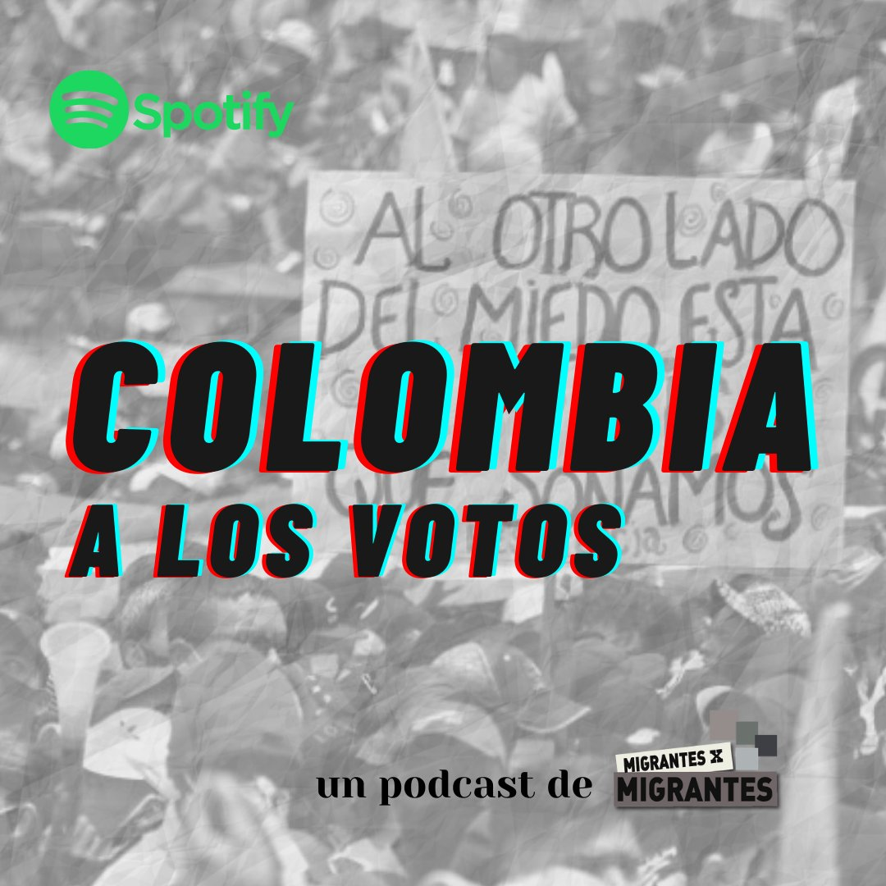

## Elecciones presidenciales en Colombia

A días de vivir una de las elecciones más importantes de su historia, desde migrantes x migrantes nos adentramos en el contexto político y social de estos comicios, cómo funciona su sistema electoral y los testimonios de colombianos y colombianas que ejercerán su derecho en Argentina.

Para lxs colombianx en el exterior, las elecciones comenzaron el pasado lunes 23 de mayo. ¿Cómo viven estos comicios lxs colombianxs migrantes?

🎤 Con la participación de:

🔸 Sandra Botero -Profesora de Ciencia Política @urosario

🔸 Laura Capote - Sec Continental @alba_movimientos y @marchacapituloarg

🔸 Facundo Cruz - Politólogo UBA e investigador

🔸 Michael Armero - Militante @colombiahumanabuenosaires

🔸 Verónica Jaramillo - Investigadora @unlaoficial

🔸 Andrea Gómez - Socióloga

## Escúchalo en Spotify y en Youtube

Desde consulados y embajadas también vivimos #ALosVotos 🗳️

<iframe width="560" height="315" src="https://www.youtube.com/embed/LW2sesfPbOA" title="YouTube video player" frameborder="0" allow="accelerometer; autoplay; clipboard-write; encrypted-media; gyroscope; picture-in-picture" allowfullscreen>

</iframe>
