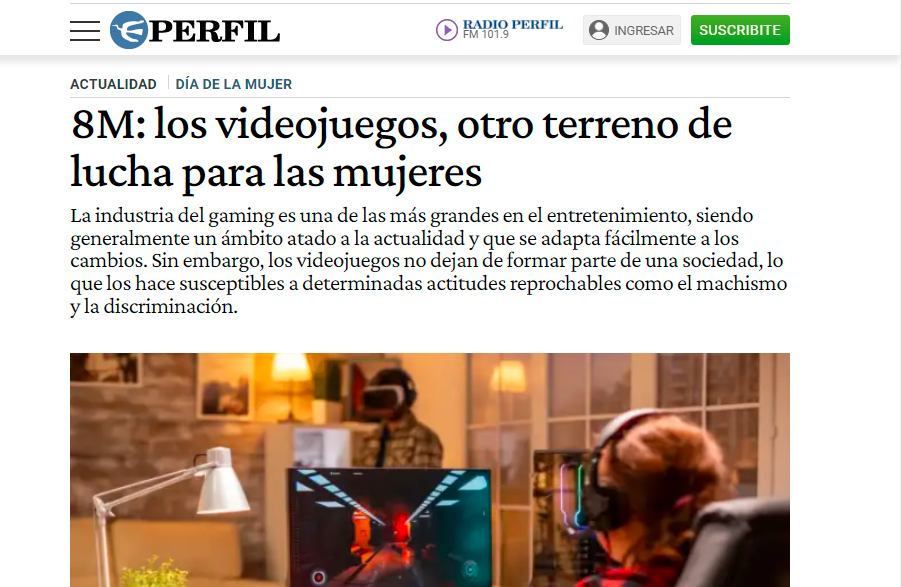

## El papel de la sociedad



El año pasado la periodista Ayelen Segovia se contacto comigo para sumar aportes sociólogicos y de género(s) sobre el rol de las mujeres en tecnología y en particular el rubro de los videojuegos.

Hoy una parte de la entrevista aparece en su última nota en diario Perfil donde hablamos sobre el rol de la sociedad para impulsar mayor participación de mujeres en tecnologia y acciones concretas para su efectiva realización.

Participaron en conjunto otras mujeres parte de comunidades de tecnologia enfocadas en videojuegos tales como Women in Games Argentina, entre otras.

Lee el artículo completo en [*Perfil.com*](https://www.perfil.com/noticias/actualidad/8m-los-videojuegos-otro-terreno-de-lucha-para-las-mujeres.phtml)

<blockquote class="twitter-tweet">

<p lang="es" dir="ltr">

Nota de hoy porque el 8M no pasa desapercibido para ninguna mujer. En este caso, dejo mi pequeño aporte para visibilizar lo que a la gran mayoría nos pasa en todos los ámbitos, incluidos los videojuegos 💪🏻🎮<a href="https://twitter.com/hashtag/8M2022?src=hash&amp;ref_src=twsrc%5Etfw">#8M2022</a><a href="https://twitter.com/hashtag/DiaInternacionalDeLaMujer?src=hash&amp;ref_src=twsrc%5Etfw">#DiaInternacionalDeLaMujer</a><a href="https://t.co/7ktjnTsl4Y">https://t.co/7ktjnTsl4Y</a>

</p>

— Ayelen (@AyelenSegovia99) <a href="https://twitter.com/AyelenSegovia99/status/1501267963504062464?ref_src=twsrc%5Etfw">March 8, 2022</a>

</blockquote>

```{=html}
<script async src="https://platform.twitter.com/widgets.js" charset="utf-8"></script>
```
