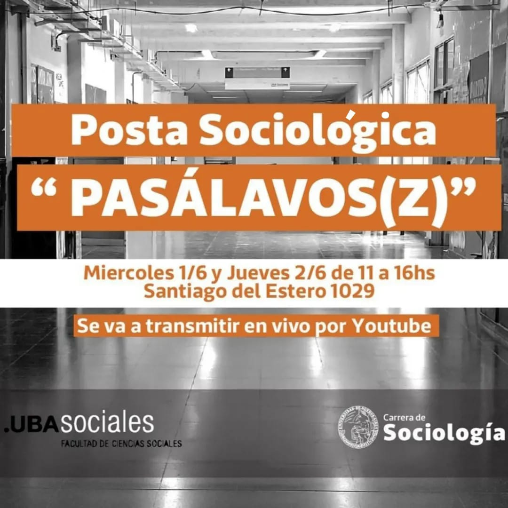
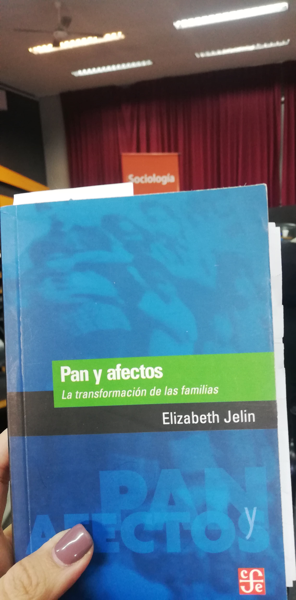

## Posta sociológica PASALAVOS(Z) 📢 Celebración y socialización del conocimiento

*El 1ro. de junio se conmemora el día del Sociólogx* en homenaje a la primera Cátedra de Sociología en Argentina, dictada en el año 1899 por Antonio Dellepiane.

Desde la carrera de sociología de la UBA en conmemoración de la fecha, realizaron una nueva edición de sociología en vivo a nivel interclaustros invitando a estudiantes, graduados y docentes a presentar un libro sobre el autor o autora que, dentro del campo de nuestra disciplina, hubiera interpelado nuestro paso por la carrera.

## Pan y Afectos - Elizabeth Jelin

De las pocas autoras que leemos en la carrera, Elizabeth Jelin fue de mis favoritas. Primero conocí su obra y luego su trayectoria profesional. Fue de las primeras mujeres sociólogas en Argentina, trabajando con temáticas de derechos humanos, la ciudadanía, género, familia y movimientos sociales.

Su libro Pan y afectos llegó de manera desprevenida pero cautivadora cuando empecé a leer y a entender la estructura de la familia nuclear y de los mandatos sociales en una de las instituciones sociales más fuertes que tenemos como sociedad: la familia. En tiempos en los que estamos acostumbrados a hablar de Ni Una Menos, Jelin fue pionera en hablar estas temáticas ya en la decada del 90 cuando no hacía ruido la violencia hacía las mujeres, en donde todavía no se hablaba de violencia doméstica o de violencia en las infancias. Fueron las bases en la sociedad argentina para dar paso a la llegada de nuevos estudios y avances en temáticas de género, entre otros temas.

Su nombre y su legado no podían faltar en una jornada tan importante para la carrera de sociología. Pan y afectos es sólo una pequeña muestra de su gran labor sociológica.

## Sociología en vivo - participantes

