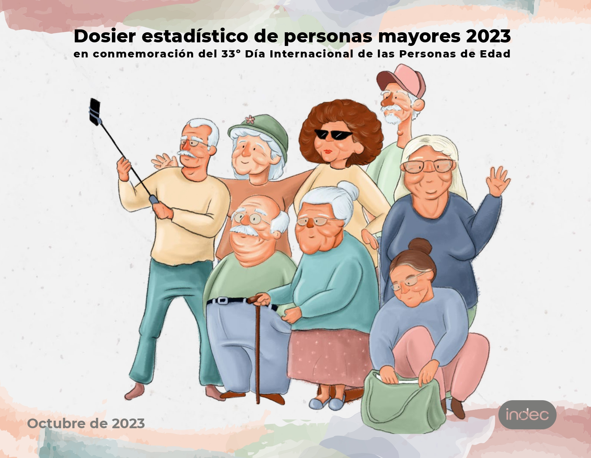

# Qué dicen las estadísticas y una mirada al contexto actual en R.



La capacidad de las personas de disponer de bienes en general, económicos y no económicos, hacen de la calidad de vida un elemento clave para la subsistencia a lo largo del ciclo de vida. De esta manera, la seguridad económica de las personas mayores se define como la capacidad de disponer y usar de forma independiente y autónoma, una cierta cantidad de recursos económicos regulares y en montos suficientes para asegurar una buena calidad de vida. El cual permite a las personas mayores satisfacer las necesidades objetivas que agregan calidad a los años, y disponer de independencia en la toma de decisiones. Además, mejora su autoestima, al propiciar el desempeño de roles significativos y la participación en la vida cotidiana como ciudadanos con plenos derechos (Huenchuan y Guzmán, 2006).

A medida que las personas envejecen se retiran del mercado laboral y esto deriva a la necesidad de contar con sistemas de protección social que garanticen la percepción de un ingreso. Así, la seguridad económica permite generar las condiciones para un envejecimiento con dignidad y seguridad. De acuerdo con las Naciones Unidas, la seguridad económica constituye una legítima aspiración en la vejez, tanto en el caso de una persona que ha contribuido durante toda su vida a la seguridad social como en el de otra que, por su trayectoria laboral o por otras razones, no cumple con los requisitos suficientes para acceder a una pensión contributiva (Naciones Unidas, 1995).

En Argentina, el Sistema Integrado de Jubilaciones y Pensiones comprendidas en la [Ley 24.241](https://servicios.infoleg.gob.ar/infolegInternet/anexos/0-4999/639/texact.htm) establecen el marco normativo de cobertura, beneficios y requisitos para la prestación básica universal, entre otros. En este informe se utilizarán las fuentes de datos oficiales del INDEC y ANSES para relevar las estadísiticas nacionales con indicadores publicados que den cuenta del alcance de este sistema y su implicancia en la seguridad económica. Para este análisis se definirá a personas mayores a aquellas que se encuentran en la edad jubilatoria por ley definida para las mujeres a patir de 60 años y más, y en el caso de los varones a partir de los 65 años y más.

```{r setup, include=FALSE}
knitr::opts_chunk$set(echo = TRUE)
```

```{r include=FALSE}
# Librerias de trabajo 
library(tidyverse)
library(eph)
library(plotly)
library(htmltools)
library(openxlsx)
library(readxl)
library(gt)

options(scipen = 9999)
```

## Fuentes de datos {.tabset}

Para este informe, trabajaremos con la Encuesta Permanente de Hogares (EPH) total urbano, principal programa nacional de producción sistemática y permanente de indicadores sociales que lleva a cabo el Instituto Nacional de EstadÌstica y Censos (INDEC), que permite conocer las caracterÌsticas sociodemográficas y socioeconómicas de la población.

Y el Boletín Estadístico de la Seguridad Social (BESS) es una publicación trimestral del ANSES que brinda cuadros de series estadísticas consolidadas y actualizadas sobre las variables más relevantes de la seguridad social en la Argentina, entre ellas la del Sistema Integrado Previsional Argentino (SIPA).

### INDEC - EPH

-   [Encuesta Permanente de Hogares total nacional urbano 2023](https://www.indec.gob.ar/indec/web/Institucional-Indec-BasesDeDatos)

-   [Diseño de registro](https://www.indec.gob.ar/ftp/cuadros/menusuperior/eahu/EPH_tot_urbano_estructura_bases_2023.pdf)

Con la encuesta se trabajará con las bases de hogar y personas para dar cuenta de indicadores de tipo socioeconómico. Su mayor cobertura geográfica se brinda se encuentran ya disponibles para trabajar en formato tidy.

Cobertura geográfica:

-   Total nacional de población urbana residente en hogares particulares.

-   Total 31 aglomerados urbanos.

-   Totales provinciales de población urbana residente en hogares particulares.

```{r indec}
# base_personas <- get_total_urbano( year = 2023, type = "individual", vars = "all")
# base_hogares <-  get_total_urbano( year = 2023, type = "hogar", vars = "all")

base_personas <- read.delim("data/personas2023.txt", sep = ";")
base_hogares <- read.delim("data/hogares2023.txt", sep = ";")


EPHU2023 <- base_personas %>% 
  left_join(base_hogares %>% select(-PONDERA),
            by = c("CODUSU", "NRO_HOGAR", "ANO4","PROVINCIA", "AGLOMERADO"))
```

### ANSES - BESS

[Boletín Estadístico de la Seguridad Social](https://www.argentina.gob.ar/trabajo/seguridadsocial/bess): Sistema previsional Contributivo - Pasivos.

Estos registros administrativos cuentan con los datos únicamente por cuadros de excel, antes de usarlo vamos a transformarlo en tablas para que quede en formato *tidy* y se puedan procesar sus respectivos indicadores. Esto solo se realizará para los cuadros 2.3.2 y 2.3.12.

-   La cobertura geográfica: Total del país

```{r anses, include=FALSE, paged.print=FALSE}
#Cuadro 2.3.2
BESS232 <- read_excel("data/estadisticas_de_seguridad_social_pasivos_03-2024.xlsx", sheet = "2.3.2")

male <- BESS232[29, 1:4]
colnames(male) = c("Anio", "TotalJubilaciones", "ConMoratoria", "SinMoratoria")
male$Sexo = "Masculino"
male$Anio = 2024

female <- BESS232[29, c(1,8:10)]
colnames(female) = c("Anio", "TotalJubilaciones", "ConMoratoria", "SinMoratoria")
female$Sexo = "Femenino"
female$Anio = 2024

BESS232 <- rbind(male, female)

#Cuadro 2.3.12

BESS2312 <- read_excel("data/estadisticas_de_seguridad_social_pasivos_03-2024.xlsx", sheet = "2.3.11-12")

male <- BESS2312[6, c(1,27:29)]
colnames(male) = c("Jurisdiccion", "TotalJubilaciones", "ConMoratoria", "SinMoratoria")
male$Sexo = "Masculino"

female <- BESS2312[6, c(1,33:35)]
colnames(female) = c("Jurisdiccion", "TotalJubilaciones", "ConMoratoria", "SinMoratoria")
female$Sexo = "Femenino"

BESS2312 <- rbind(male, female)
```

## Qué dicen las estadísiticas oficiales: factores que influyen en la seguridad económica

Los factores relacionados con el curso vital se refieren en primera instancia a la *biografía individual*, es decir a la trayectoria laboral de las personas mayores. Acompañado de *biografías generacionales*, en referencia al contexto generacional de vida en donde influyen factores propios de la historia social, económica y política de la sociedad de que es parte.

Otro factor que componen la seguridad económia, es el *ciclo vital individual y familiar*, que da cuenta de las personas que rodean a las personas mayores, que alude directamente a la familia y que interrelaciona los ciclos de vida de los diferentes miembros de la familia determinan por una parte las cargas que deben sobrellevar las personas mayores, y por otra las posibilidades de ayuda a las que podrían optar.

Y por último, las *características de los sistemas de protección social* que se reflejan en oportunidades o amenazas para lograr un ingreso sustituto digno en la edad avanzada y consecuentemente las posibilidad o no de acceder a atención en salud, entre otros servicios.

Para dar cuenta de estos factores, se exponen cinco indicadores (que presentan desde el dosier estadístico de personas de edad publicado por el INDEC) en tres tópicos: Composición de los hogares, cobertura previsional e Ingresos.

### Composición de los hogares

Una de los factores a visualizar es el ciclo vital individual y familiar, que de cuenta a grandes rasgos del entorno en el que viven las personas mayores y su acompañamiento directo en el hogar que puede ser familiar o no, también se puede contemplar las biografías generacionales que le acompañan. Para esto se mide el estrato generacional del hogar que es el criterio que ordena a la población según el número de generaciones convivientes en el hogar. En este sentido, la población de personas mayores se clasifica en hogares:

-   unipersonales: aquellos en los que reside una sola persona de 60 años y más.
-   unigeneracionales: conformados por más de una persona y donde todos los miembros tienen 60 años y más.
-   multigeneracionales: conformados por más de una persona y donde al menos convive una persona de 60 años y más, y una persona menor de 60 años.

```{r indicador 1, message=FALSE, warning=FALSE}
#armado de variables previas para armar indicador, se dividen grandes grupos de edad y estrato generacional 

estrato <- EPHU2023 %>% 
    mutate(edad_categorica = case_when(CH06 <= 59 ~ 1, #grupo de edad
                           CH06 >= 60 ~ 2)) %>% 
    count(CODUSU, NRO_HOGAR, edad_categorica) %>% #conteo de CODUSU y edades categoricas en los hogares
    count(CODUSU, NRO_HOGAR) %>% 
  mutate(Estrato0 = ifelse(n == 2, "multigeneracional", "unigeneracional")) %>% 
  select(-n)

#cada componente de la base esta asignado a una edad categorica y condicion generacional del hogar que compone
#unigeneracional: mismo grupo de edad categórica, o multigeneracional; al menos convive una persona de cada grupo de edad categórica


Cuadro1 <- EPHU2023 %>% 
    left_join(estrato, by = c("CODUSU", "NRO_HOGAR")) %>% 
     mutate(edad_categorica = case_when(CH06 <= 59 ~ 1, #grupo de edad
                                        CH06 >= 60 ~ 2),
            TipoHogar = case_when(IX_TOT == 1 ~ "unipersonal", # 1 sola persona
                        IX_TOT > 1 ~ "compuesto")) %>% #más de 1 personas en el hogar
    select(CODUSU, NRO_HOGAR, IX_TOT, COMPONENTE, CH06, Estrato0, edad_categorica, TipoHogar, PONDERA, CH04) %>% 
    mutate(
      Estrato = 
        case_when(
          TipoHogar == "unipersonal" & edad_categorica == 2 ~ "unipersonal",
          TipoHogar == "compuesto" & edad_categorica == 2 & 
            Estrato0 == "unigeneracional" ~ "unigeneracional",
          TipoHogar == "compuesto" &  Estrato0 == "multigeneracional" ~ 
            "multigeneracional",
          IX_TOT >= 1 & edad_categorica == 1 ~ "sin PM")) %>% #hogares sin personas mayores
    select(CODUSU, NRO_HOGAR, IX_TOT, COMPONENTE, CH06, Estrato, Estrato0,edad_categorica, PONDERA,CH04) %>%
  mutate(Grupo = case_when(CH06 %in% c(60:74) ~ "1", #grupos de edad
                           CH06 >= 75 ~ "2",
                           TRUE ~ "3")) %>%
  filter(CH06 >= 60) %>% 
  group_by(Grupo, CH04) %>% 
  summarise( #armado de categorias para la variable
    Poblacion = sum(PONDERA),
    Unipersonal = sum(PONDERA [Estrato == "unipersonal"]),
    Unigeneracional = sum(PONDERA [Estrato == "unigeneracional"]),
    Multigeneracional = sum(PONDERA [Estrato == "multigeneracional"]),
    Sin_PM = sum(PONDERA [Estrato == "sin PM"]),
    "hogares unipersonales" = round(Unipersonal/Poblacion*100,1),
    "hogares unigeneracionales" = round(Unigeneracional/Poblacion*100,1),
    "hogares multigeneracionales" = round(Multigeneracional/Poblacion*100,1)
  ) %>% 
  rename(Sexo = CH04) %>% 
  mutate(Sexo = case_when(Sexo == 1 ~ "Varones", Sexo == 2 ~ "Mujeres"),
         Grupo = case_when(Grupo == "1" ~ "60 a 74 años" , 
                           Grupo == "2" ~ "75 años y más", 
                           TRUE ~ "< 60 años")) %>% 
  select(1,2,8,9,10) %>% 
  pivot_longer(cols = c(3,4,5), names_to = "Tipo_hogar", values_to = "porcentaje")


paleta3 <- c("#f7b801", "#7678ed", "#3d348b") 

ggplot(Cuadro1, 
       aes(fill= Tipo_hogar, x=Grupo, y=as.numeric((porcentaje)) )) + 
  geom_col() +
  scale_fill_manual(values = paleta3)+
  facet_grid(~Sexo) +
  theme_light() +
  labs(
    title = "Gráfico 1: Distribución de la población de 60 años y más por grupos de edad y sexo,\nsegún estrato generacional del hogar. Total nacional urbano. Año 2023",
    y = "porcentaje", x = "Grupo de edad",
    caption = "Fuente: INDEC, Encuesta Permanente de Hogares total urbano."
  ) +
  geom_text(aes(label = porcentaje, group = Sexo),
            position = position_stack(vjust = .5),size = 4, colour = "white") +
  theme(legend.position = "bottom", legend.title = element_blank()) 
```

Casi más del 50% de personas entre los 60 y 74 años vive en hogares multigeneracionales, mientras que en el rango de los 75 años y más, del lado de los varones conviven más en hogares unigeneracionales y del lado de las mujeres se reparte entre valores similares vivir en hogares multigeneracionales y hogares unipersonales.

### Cobertura previsional

Al momento de retiro del mercado laboral, se deriva la necesidad de contar con sistemas de protección social que garanticen la percepción de un ingreso.

```{r indicador 2, message=FALSE, warning=FALSE}

# total poblacion en edad jubilatoria
cuadro2A <- base_personas %>% 
  select(CH04, CH06, V2_M, V21_M, PONDII) %>%
  summarise(
    Poblacion_mayor = sum(PONDII[CH06 >= 60 & CH04 == 2 | CH06 >= 65 & CH04 == 1 ]),
    Poblacion_mayor_jp  = sum(PONDII[CH06 >= 60 & CH04 == 2 & (V2_M > 0| V21_M >0) 
                                     |CH06 >= 65 & CH04 == 1 &  (V2_M > 0|V21_M >0)]),
    porcentaje = round(Poblacion_mayor_jp/Poblacion_mayor*100,1)) %>% 
  cbind( "CH04" = "Total") 


#Por sexo
cuadro2B <- base_personas %>% 
  select(CH04, CH06, V2_M,V21_M, PONDII) %>%
   group_by(CH04) %>% 
   summarise(
     Poblacion_mayor = sum(PONDII[CH06 >= 60 & CH04 == 2 | CH06 >= 65 & CH04 == 1 ]),
     Poblacion_mayor_jp  = sum(PONDII[CH06 >= 60 & CH04 == 2 & (V2_M > 0) |
                    CH06 >= 65 & CH04 == 1 & (V2_M > 0) ]),
    porcentaje =  round(Poblacion_mayor_jp/Poblacion_mayor*100,1)) %>% 
    mutate(CH04 = case_when(CH04 == 1 ~ "Varones", #Varones de 65 años y más
                            CH04 == 2 ~ "Mujeres")) #Mujeres de 60 años y más

Cuadro2 <- rbind(cuadro2A, cuadro2B) %>% 
  mutate(CH04 = fct_relevel(CH04, c("Total", "Mujeres", "Varones")),
         cobertura = case_when(
           CH04 == "Total" ~ "Población en edad de jubilarse",
           CH04 == "Mujeres" ~ "Mujeres de 60 años y más",
           CH04 == "Varones" ~ "Varones de 65 años y más"),
         cobertura = fct_relevel(cobertura, c("Población en edad de jubilarse", 
                                              "Mujeres de 60 años y más", 
                                              "Varones de 65 años y más")))
  

paleta1 <- c("#fb8b24", "#d90368", "#820263")

ggplot(Cuadro2, aes(cobertura,porcentaje)) +
           geom_col( aes(width = 0.5,fill = cobertura)) +
           ylim(0,100) +
           theme_classic() +
           scale_fill_manual(values = paleta1) +
           geom_text(aes(label = porcentaje), vjust = 2, colour = "white") +
           theme(legend.position = "none") +
           labs(title = "Gráfico 2: Porcentaje de población en edad de jubilarse con cobertura previsional, \n por sexo. Total nacional urbano. Año 2023.",
                x = " ",
                y = "porcentaje",
                caption = "Fuente: INDEC, Encuesta Permanente de Hogares total urbano."
                )
```

El *89,8%* de la población en edad jubilatoria del total nacional urbano, cuenta con cobertura previsional. Se puede decir que esta cobertura es casi universal en el país como resultado del sistema jubilatorio.

Si bien la biografía individual da cuenta de la trayectoria laboral de las personas, esta trayectoria no es igual para todos a la hora de beneficiarse en el sistema de seguridad social, esta situación varia acorde al contexto (biografía generacional) y se intensifica desfavorablemente hacía las mujeres. Ya sea porque no cumple con los requisitos mínimos u otras desigualdades estructurales de género.

```{r indicador 3}

tabla3 <- BESS232 %>% 
  mutate(
    ConMoratoria = as.numeric(ConMoratoria),
    SinMoratoria = as.numeric(SinMoratoria),
    TotalJubilaciones = as.numeric(TotalJubilaciones),
    porcentaje_con = round(ConMoratoria/TotalJubilaciones*100,1),
    porcentaje_sin = round(SinMoratoria/TotalJubilaciones*100,1)) 
    
# gráfico 
tabla3 %>% 
    pivot_longer(cols = c(6,7), names_to = "regimen", values_to = "porcentaje") %>% 
  mutate(regimen = case_when(regimen == "porcentaje_con" ~ "con moratoria",
                             regimen == "porcentaje_sin" ~ "sin moratoria"
                             )) %>% 
  ggplot(aes(Sexo,porcentaje)) +
  geom_col(aes(fill = regimen)) +
  theme_classic() +
  scale_fill_manual(values = c("#f7b801", "#7678ed")) +
    labs(title = "Gráfico 3: Distribución porcentual de las jubilaciones del sistema integrado previsional,\npor sexo y adhesión a moratoria. Total del país. Marzo de 2024",
         x = "Sexo",
         y = "porcentaje",
         caption = "Fuente: ANSES, Boletín Estadísitico de la Seguridad Social.")
  
tabla3 %>% 
  select(5,2:4,6,7,-1) %>% 
  gt() %>% 
   tab_header(
    title = md("Cuadro 1: Distribución porcentual de las jubilaciones del sistema integrado previsional,\npor sexo y adhesión a moratoria. Total del país. Marzo de 2024")) %>%
  tab_spanner(
    label = "Beneficios por jubilación",
    columns = c(TotalJubilaciones,ConMoratoria, SinMoratoria)) %>% 
  tab_spanner(
    label = "% por jubilación",
    columns = c(porcentaje_con, porcentaje_sin)) %>%
  cols_label(TotalJubilaciones = 'Total', 
             ConMoratoria = 'con moratoria', 
             SinMoratoria = 'sin moratoria', 
             porcentaje_con = 'con moratoria', 
             porcentaje_sin = 'sin moratoria') %>%
  tab_source_note(
    source_note = md("**Fuente**: ANSES, Boletín Estadísitico de la Seguridad Social.")
  )

```

Con la legislativos actual sobre el sistema previsional. A marzo de 2024, el *79%* de mujeres en edad jubilatoria percibe jubilición a través del régimen de adhesión con moratoria, a diferencia, no menor, de los varones en edad jubilatoria a un *46.4%*.

### Ingresos

La situación económica de las personas mayores está determinada por su poder adquisitivo; que puede provenir de diversas fuentes: trabajo, ahorros, jubilaciones o pensiones, entre otros.

Para este indicador se definieron como fuentes de ingresos:

• Ingresos laborales: ingresos provenientes de la ocupación principal, de la ocupación secundaria y de otras ocupaciones que pudieran haber generado ingresos en el mes de referencia.

• Ingresos por jubilaciones y pensiones: ingresos de la seguridad social por jubilación y pensión, y aguinaldo proveniente de estas prestaciones.

• Otros ingresos: subsidios o ayuda social, rentas de la propiedad derivadas de la producción o de inversiones financieras y otras transferencias.

```{r indicador 4, message=FALSE, warning=FALSE}
#Ingresos laborales: P21 y TOT_P12
#Ingresos por jubilación o pensión: V2_M y V21_M
#Ingresos no laborales; V5_M, V8_M, V9_M, V10_M, V11_M, V12_M, V18_M y V19_AM

#Total
Cuadro4A <- EPHU2023 %>% 
  filter(CH06 >= 60) %>%
  mutate(Ingresolaboral = case_when((P21 > 0 | TOT_P12 > 0) ~ 1,TRUE ~ 0), 
         IngresoJP = case_when((V2_M > 0 | V21_M > 0) ~ 1, TRUE ~ 0), 
         IngresoNoLaboral = case_when((V5_M > 0 | V8_M > 0 | V9_M > 0 |
                               V10_M > 0 | V11_M > 0 | V12_M > 0 | 
                               V18_M > 0 | V19_AM > 0) ~ 1,TRUE ~ 0)) %>%
  summarise(
    poblacion60ymas = sum(PONDII), # total población 60 años y más
    pobl60_IL = sum(PONDII[Ingresolaboral == 1]), #ingresos laborales
    pobl60_JP = sum(PONDII[IngresoJP == 1]), #jubilación o pensión
    pobl60_OI = sum(PONDII[IngresoNoLaboral == 1]), #no laborales
    "Ingresos laborales" = 
           round(pobl60_IL/poblacion60ymas*100,1),
    "Jubilación o pensión" =
           round(pobl60_JP/poblacion60ymas*100,1),
    "Otros ingresos no laborales" =
           round(pobl60_OI/poblacion60ymas*100,1)) %>%
  cbind(CH04 = "Total")


#Por sexo
Cuadro4B <- EPHU2023 %>% 
  filter(CH06 >= 60) %>%
  mutate(Ingresolaboral = case_when((P21 > 0 | TOT_P12 > 0) ~ 1,TRUE ~ 0), 
         IngresoJP = case_when((V2_M > 0 | V21_M > 0) ~ 1, TRUE ~ 0), 
         IngresoNoLaboral = case_when((V5_M > 0 | V8_M > 0 | V9_M > 0 |
                               V10_M > 0 | V11_M > 0 | V12_M > 0 | 
                               V18_M > 0 | V19_AM > 0) ~ 1,TRUE ~ 0)) %>% 
  group_by(CH04) %>% 
  summarise(
    poblacion60ymas = sum(PONDII), # total población 60 años y más
    pobl60_IL = sum(PONDII[Ingresolaboral == 1]), #ingresos laborales
    pobl60_JP = sum(PONDII[IngresoJP == 1]), #jubilación o pensión
    pobl60_OI = sum(PONDII[IngresoNoLaboral == 1]), #no laborales
    "Ingresos laborales" = 
           round(pobl60_IL/poblacion60ymas*100,1),
    "Jubilación o pensión" =
           round(pobl60_JP/poblacion60ymas*100,1),
    "Otros ingresos no laborales" =
           round(pobl60_OI/poblacion60ymas*100, 1)) %>% 
    mutate(CH04 = case_when(CH04 == 1 ~ "Varones", 
                          CH04 == 2 ~ "Mujeres"))

Cuadro4 <- rbind(Cuadro4A, Cuadro4B) %>% 
  select(8, 5:7) %>% 
  pivot_longer(cols = c(2:4), names_to = "Tipo_ingreso", values_to = "porcentaje") %>% 
  mutate(CH04 = fct_relevel(CH04, c("Total", "Mujeres", "Varones")))


ggplot(Cuadro4, aes(CH04, porcentaje, fill = CH04)) +
  geom_col() +
  #coord_flip() +
  facet_wrap(~ Tipo_ingreso) +
  #theme_classic() +
  scale_fill_manual(values = paleta1) +
  theme(legend.position = "none") +
  geom_text(aes(label = porcentaje), vjust = 1, colour = "white") +
  labs(title = "Gráfico 4: Porcentaje de población en edad de jubilarse perceptora de ingresos, por fuente y sexo. \nTotal nacional urbano. Año 2023",
                x = " ",
                y = "porcentaje",
                caption = "Fuente: INDEC, Encuesta Permanente de Hogares total urbano."
                )
```

La mayoria de los ingresos de las personas en edad de jubilarse corresponden a jubilación o pensión. La cobertura previsional garantiza un margen de derecho para la calidad de vida personas mayores. Las mujeres de 60 años y más perciben en su gran mayoría ingresos por jubilación o pensión, en cambio los varones de 65 años y más siguen con presencia en el mercado de trabajo con ingresos laborales de un 35%.

Al ser el mayor ingreso de las personas mayores, es importante dar cuanta cuál es el haber jubilitario actual a marzo 2024 por tipo de régime adherido a moratoria:

```{r indicador 5}
tabla5 <- BESS2312 %>% 
  mutate(
    ConMoratoria = as.numeric(ConMoratoria),
    SinMoratoria = as.numeric(SinMoratoria),
    TotalJubilaciones = as.numeric(TotalJubilaciones))


tabla5 %>% 
  pivot_longer(cols = c(3,4), names_to = "regimen", values_to = "haber_medio") %>% 
  mutate(regimen = case_when(regimen == "ConMoratoria" ~ "con moratoria",
                             regimen == "SinMoratoria" ~ "sin moratoria"
                             )) %>% 
  ggplot(aes(regimen, haber_medio))+
  geom_col(aes(fill = Sexo), position = "dodge") +
  scale_fill_manual(values = c( "#d90368", "#820263")) +
  geom_text(aes(label = round(haber_medio,0), group = Sexo), position = position_dodge(0.9), vjust = 0, colour = "black") +
  labs(title = "Gráfico 5: Haber jubilatorio medio, según sexo y adhesión a moratoria.\nTotal del país. Marzo de 2024",
                y = "En miles de pesos",
                x = "Régimen",
                caption = "Fuente: ANSES, Boletín Estadísitico de la Seguridad Social."
                )

```

Existe una gran diferencia de haber entre tipo de régimen (casi un 50%), y no deja de existir diferencias entre mujeres y varones dentro de los montos del misno régimen.

## Contexto actual: Argentina 2024

Para las personas mayores pagar el alquiler, comida, salud y otros bienes y servicios dependen de sus ingresos y posición financiera. Esto puede aumentar o limitar su bienestar y calidad de vida, no hay opción de mejora en este bienestar que no sea a través de la cobertura previsional, que es su mayor fuente de ingreso. La pobreza es el mayor obstáculo para un envejecimiento decente y seguro.

Del registro de haberes medios a marzo de 2024 con una inflación acumulada del 287.9% deja un escenario crítico para las personas mayores, se debilita la seguridad económica que garantiza plenitud en la calidad de vida. Al ser la mayor fuente de ingreso, para los haberes con moratoria su monto esta por debajo de la Canasta básica total que para el mismo mes fue de \$250.286 (Línea de pobreza para un adulto equivalente). Lo haberes sin moratorias a duras penas superan el monto pero la difultad para adquirir bienes y servicios persiste.

Hay ciertos factores de la seguridad económica en argentina que están cubiertas por las leyes actuales que garantiza a diferencia de otros países de la región un sistema jubilatorio casi universal pero estos no están siendo acompañados por políticas monetarias previsionalesque sobrelleven la alta inflación y el exacerbado aumento de los precios al consumidor. Lo que lleva a una perdida de la autonomía económica y deriva en restricciones que pueden afectar el bienestar físico y mental de las personas mayores. Se deben dar prioridades a condiciones ecónomica y no económicas para un envejecimiento con dignidad y seguridad.

## Fuentes bibliográficas

-   [Huenchuan S. & Guzmán, J.M. (2006) Seguridad Económica y Pobreza en la Vejez: Tensiones, Expresiones y Desafíos para Políticas](https://www.cepal.org/sites/default/files/events/files/huenchuan_guzman.pdf) Reunión de Expertos sobre Población y Pobreza en América Latina y el Caribe.
-   [S. Huenchuan (ed.), Envejecimiento, personas mayores y Agenda 2030 para el Desarrollo Sostenible: perspectiva regional y de derechos humanos, Libros de la CEPAL, N° 154 (LC/PUB.2018/24-P), Santiago, Comisión Económica para América Latina y el Caribe (CEPAL), 2018.](https://repositorio.cepal.org/server/api/core/bitstreams/431e4d95-46d9-4de6-a0a6-d41b1cb7d0b9/content)
-   [INDEC, Dosier estadístico de personas mayores 2023](https://www.indec.gob.ar/ftp/cuadros/poblacion/dosier_personas_mayores_2023.pdf)
