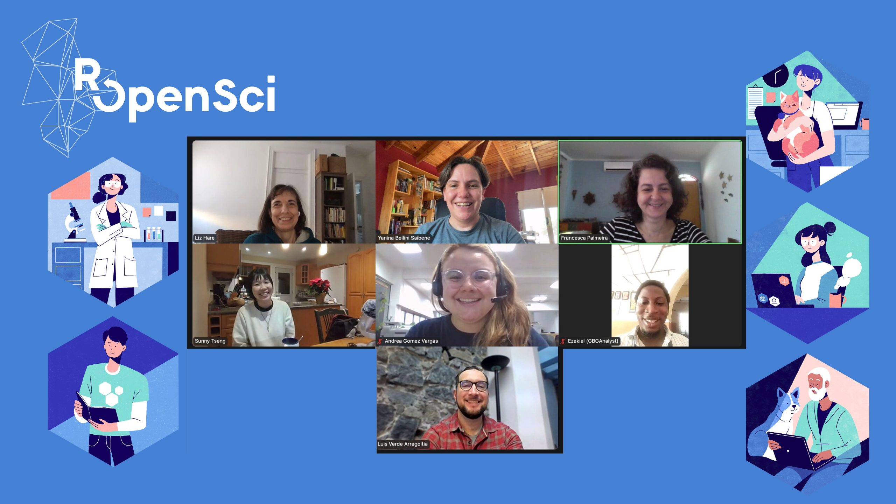

# Champions rOpenSci

Llegó el segundo llamado para el programa de campeones y campeonas de rOpenSci a mediados de 2023, y sentí que era el momento de postularme para llevar mis conocimientos de R al siguiente nivel. Quería abordar de manera profesional los temas con los que más trabajo y me interesan: la información censal.

Así fue como decidí postularme para desarrollar el paquete de datos censales oficiales de Argentina. Confiada en aprender de los mejores, me comprometí con el programa al saber que había quedado seleccionada entre 10 personas de un total de 98 postulantes a nivel mundial.

> [Introducing rOpenSci Champions - Cohort 2023-2024](https://ropensci.org/blog/2024/02/15/champions-program-champions-2024/)

La cohorte duró un año y me brindó la oportunidad de conocer personas apasionadas por R en todo el mundo, sumando ideas valiosas a mi proyecto. Al final del proceso, creé el paquete [***ARcenso: Data from Argentina’s Population Census***](https://soyandrea.github.io/arcenso/index.html). Además, me permitió asistir a conferencias y talleres, algo que no imaginaba que sucedería, pero que me demostró que una idea puede tener un gran impacto tanto a nivel local como internacional. Escribí un nota en el blog de rOpensci titulada [*Puentes y Comunidades. Mi Camino como Campeona de rOpenSci*](https://ropensci.org/es/blog/2025/05/15/puentes-comunidades-campeones-ropensci/) donde pude contarle a la comunidad sobre este recorrido y lo aprendido. 

Lo más importante:

> **Hoy ARcenso sigue creciendo, y yo también: con nuevas ideas, nuevos desafíos y el deseo intacto de seguir construyendo en comunidad y para la comunidad.**

::: callout-note

Todas las actividades sobre el paquete se encuentran en la sección: [conoce ARcenso](https://soyandrea.github.io/conoce-arcenso)

:::
