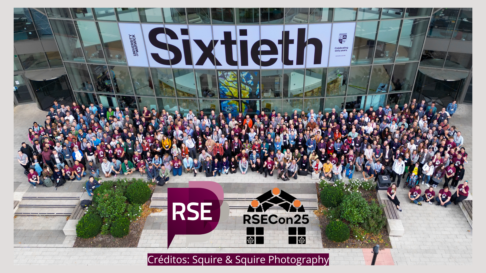
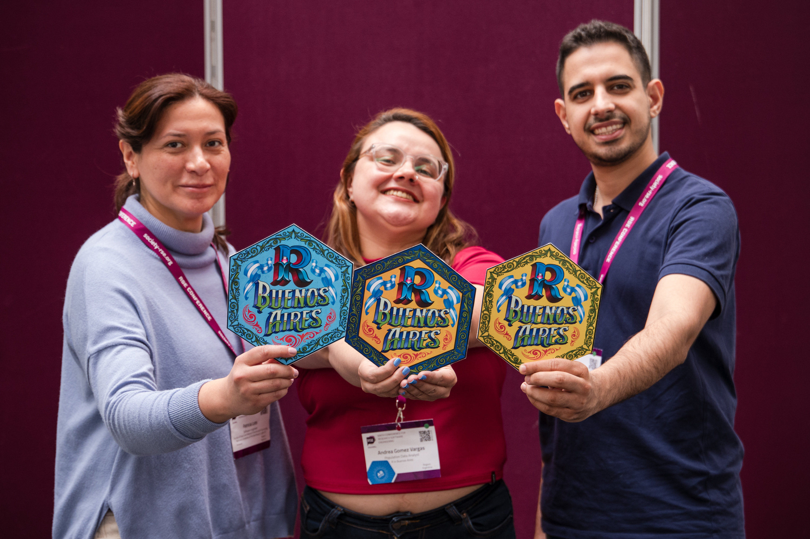
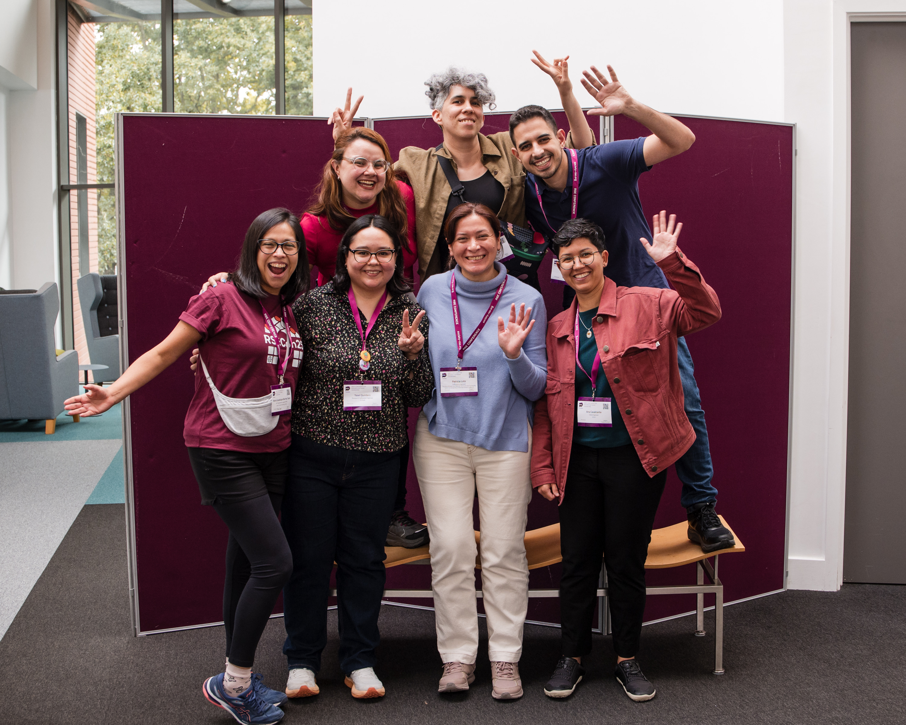

### ¿Qué es la RSECon?

{width=90%}

La Research Software Engineering Conference (RSECon) es un encuentro internacional que reúne a quienes desarrollan, mantienen y apoyan el software que impulsa la investigación científica. Participan ingenieras e ingenieros de software, investigadoras, técnicas y personas de comunidad que trabajan en la intersección entre ciencia y tecnología.

El movimiento de Research Software Engineering (RSE) nació en el Reino Unido hace más de una década, cuando un grupo de profesionales empezó a visibilizar un problema común: el software era esencial para la ciencia, pero el trabajo detrás de su desarrollo no era reconocido ni valorado dentro de la carrera académica. De esa necesidad surgió una comunidad que buscó darle nombre, identidad y espacio a ese rol.

Con los años, el movimiento creció y se extendió internacionalmente, formando capítulos en distintos países y regiones. La RSECon se consolidó como su encuentro anual, un espacio donde compartir experiencias, aprender nuevas prácticas, debatir sobre el futuro del software en la investigación y, sobre todo, fortalecer una comunidad global que trabaja por una ciencia más abierta, reproducible y colaborativa.

### ¿Cómo llegué acá?

Llegué a la RSECon25 casi de casualidad. Había recibido una beca del Global South para [asistir a R Developer Day, un evento satélite de la conferencia](https://soyandrea.github.io/comunidad/2025-Rdevday/), en la Universidad de Warwick (Reino Unido). Durante esos días mencionaron una convocatoria de becas (*bursaries*) para participar en la RSECon, destinadas a que más personas pudieran vivir la experiencia presencial, en una conferencia que busca ser accesible e inclusiva. Sin pensarlo demasiado, me postulé y semanas después me avisaron que había sido seleccionada.

No conocía mucho sobre el mundo de la **Research Software Engineering**, pero me entusiasmaba la idea de descubrir un nuevo espacio y ampliar mi mirada sobre cómo la investigación y el software se conectan (y cómo, por supuesto, R está en el medio de todo eso 💜).

Además, compartí la experiencia con Patri Loto y Ema Ciardullo, amigos de las comunidades de R, cada uno con perfiles profesionales distintos. Fuimos las únicas personas de Argentina en la conferencia, y fue muy especial poder vivir esa semana juntos entre charlas, aprendizajes y muchas conversaciones inspiradoras. También compartimos momentos con colegas de distintos países de Latinoamérica y conocimos a nuevas personas que, como nosotros, creen en el poder de la colaboración y las comunidades abiertas.

::::: columns

::: {.column width="50%"}

 

{width=90%}

:::

::: {.column width="50%"}

 

{width=90%}
:::

:::::

###  La experiencia

La experiencia fue increíble. El programa de la RSECon25 era enorme, con muchísimas actividades por hacer y charlas para elegir. Me encantó encontrar sesiones donde R era parte del tema, pero también descubrir otros aspectos de la investigación y la ciencia de datos que forman parte del día a día.

Me llevé muchas ideas e iniciativas, y los espacios sociales fueron tan abundantes como enriquecedores. Había gente de todas partes del mundo, y lo más lindo fue conocer en persona a personas que hasta ese momento solo conocía por las comunidades virtuales. No sabía que iban a estar allí, y fue una hermosa sorpresa encontrarlas tan cerca.

También me sorprendió encontrar organizaciones y comunidades que conocía de nombre, pero esta vez en vivo, junto con sus integrantes: rOpenSci, el Software Sustainability Institute, OLS y universidades de renombre. Poder conversar con quienes impulsan esos espacios fue muy inspirador y me hizo sentir aún más parte de esta red global.

  <iframe loading="lazy" style="position: absolute; width: 100%; height: 100%; top: 0; left: 0; border: none; padding: 0;margin: 0;"
    src="https://www.canva.com/design/DAG3st7G9NI/XR8u9LiEtcVuo6k2j78t-A/view?embed" allowfullscreen="allowfullscreen" allow="fullscreen">
  </iframe>

<a href="https:&#x2F;&#x2F;www.canva.com&#x2F;design&#x2F;DAG3st7G9NI&#x2F;XR8u9LiEtcVuo6k2j78t-A&#x2F;view?utm_content=DAG3st7G9NI&amp;utm_campaign=designshare&amp;utm_medium=embeds&amp;utm_source=link" target="_blank" rel="noopener">RSECon</a> de Andrea Gomez Vargas

### RSE Day 

Inspirados por la RSECon25 y la próxima celebración del RSEDay, organizamos un encuentro virtual el 9 de octubre junto con varias comunidades de R de Latinoamérica  (RLadies Resistencia Corrientes, RLadies Chile, R en Buenos Aires y RSE Chile).

La idea era empezar a plantar la semilla sobre lo que hacemos con R, que va mucho más allá de programar: cómo construimos software para la investigación y cómo enfrentamos desafíos en nuestras profesiones y comunidades.
