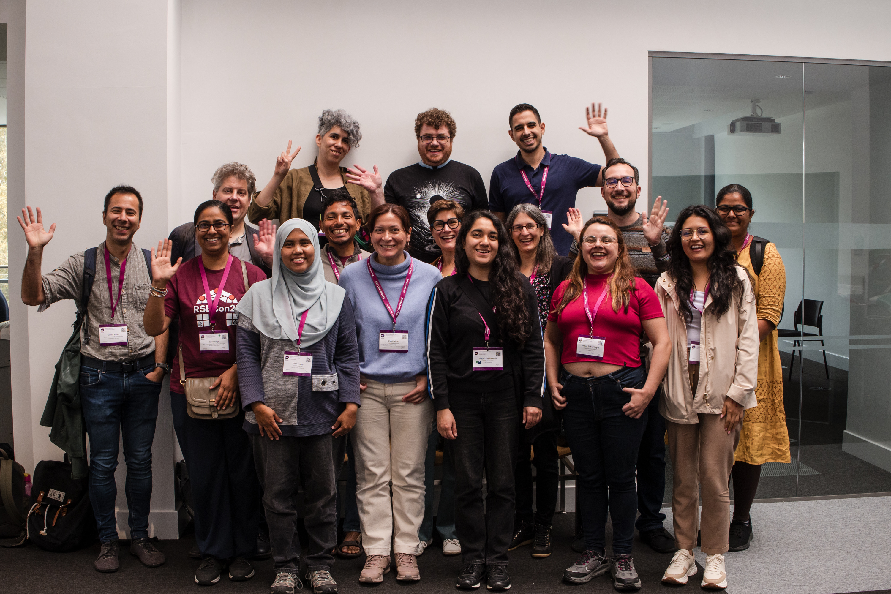
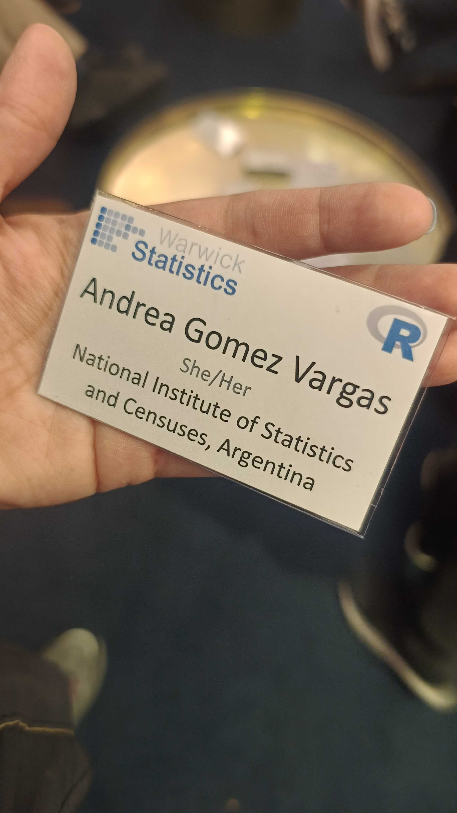
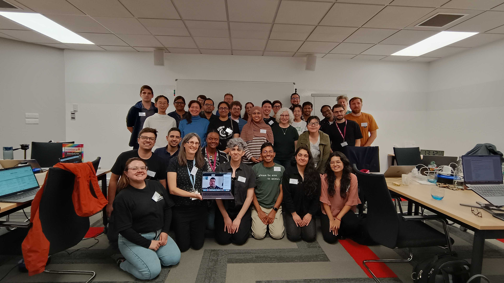

El R Dev Day es un evento colaborativo tipo hackathon dedicado a contribuir al desarrollo de R y su ecosistema. Reúne a personas con distintos niveles de experiencia desde quienes dan sus primeros pasos en contribuciones hasta desarrolladores con trayectoria para trabajar juntas en mejoras de código, documentación, traducciones y herramientas que fortalecen el software y su comunidad.

Este año, el R Dev Day se celebró como actividad satélite de la conferencia RSECon25, en la Universidad de Warwick (Reino Unido). El encuentro ofreció becas completas y parciales para participantes de distintas regiones del mundo, promoviendo la participación internacional y el intercambio entre comunidades, especialmente del Sur Global. **Gracias a una de esas becas, tuve la oportunidad de participar presencialmente, representando a la comunidad de R en Buenos Aires y a América Latina.**

{width="80%" fig-align="center"}

El encuentro tuvo lugar el 12 de septiembre, fue una jornada completa dedicada a contribuir al desarrollo de R junto a personas de distintos lugares del mundo —desde la India hasta Argentina, pasando por México, Colombia y Chile—. Ese intercambio de ideas, conocimientos y experiencias fue tan diverso como enriquecedor.

### Contribuir, aprender y conectar

::::: columns
::: {.column width="30%"}
 

{width="80%" fig-align="center"}
:::

::: {.column width="70%"}
Durante la jornada trabajé en dos tareas diferentes. La primera fue en el [**tablero de monitoreo de traducciones de R (translations-dashboard)**](https://github.com/r-devel/translations-dashboard)), donde, en equipo, colaboramos reorganizando el plan de armado: definimos la estructura de carpetas, scripts y datos, propusimos migrarlo a un Quarto dashboard y establecimos pautas para que toda la herramienta sea reproducible y más fácil de mantener. Esta tarea implicó ordenar el proyecto de manera clara, asegurando que otros contribuyentes puedan continuar el trabajo sin dificultades.

La segunda tarea se centró en una [**contribución técnica al ecosistema de paquetes de R en CRAN**](https://github.com/r-devel/r-dev-day/issues/110#issuecomment-3366287686), que buscaba enviar pull requests para paquetes con la nota “Lost braces” en archivos Rd, ayudando a mantener la calidad y coherencia de la documentación de los paquetes. Ambas actividades fueron una gran oportunidad para aprender trabajando en equipo y aportar a un proyecto que beneficia directamente a toda la comunidad de R.
:::
:::::

### R en Buenos Aires

::::: columns
::: {.column width="50%"}
Tuve la oportunidad de presentar R en Buenos Aires, compartir lo que hacemos en nuestra comunidad y sumar a muchas personas a una foto colectiva con el hex fileteado gigante, un diseño muy tradicional de nuestra ciudad.

También contamos la historia del capítulo local, que se reactivó hace un año, y relatamos las actividades que venimos impulsando desde entonces para fortalecer el aprendizaje colaborativo. Fue muy valioso poder intercambiar experiencias y proponer iniciativas conjuntas con otras comunidades de R en el mundo, ampliando los lazos y las posibilidades de seguir construyendo en red.
:::

::: {.column width="10%"}

::: 

::: {.column width="40%"}
<iframe width="275" height="360" src="https://www.youtube.com/embed/yKsWq9XvE-E?si=j5Ohlei4ixGrU43y" title="R en Buenos Aires en el R Dev Day en Reino Unido" frameborder="0" allow="accelerometer; autoplay; clipboard-write; encrypted-media; gyroscope; picture-in-picture; web-share" allowfullscreen>

</iframe>
:::
:::::

### Entre códigos y abrazos

Valoro mucho todo lo que esta experiencia me brindó, no solo por haberme permitido conocer el Reino Unido y su cultura, sino también por sentir de cerca la fuerza de una comunidad global que crece, se apoya y se inspira mutuamente. Quiero agradecer especialmente a **Heather Turner**, por todo su trabajo en la organización y la gestión de las becas; hay un esfuerzo enorme detrás para que mi estadía, y la de todos los asistentes, fuera la mejor posible. Compartir las cenas, las charlas y la jornada fue un tiempo valioso, y me siento muy agradecida de haberlo hecho con distintos conocides de la comunidad de R, algunos de ellos ya amigos míos.

{width="75%" fig-align="center"}

Me da mucha alegría ver cómo mis aportes llegan a la comunidad, pero aún más me emociona mirar a la Andrea de años atrás: aquella que llegaba a los eventos con su notebook, sin entender casi nada de R, y hoy lidera un capítulo, comparte conocimientos y envía PRs a paquetes. Es un logro invaluable, que sin el apoyo de la comunidad no habría sido posible, y que me inspira a seguir aprendiendo, contribuyendo y acompañando a otres en su camino.

Cerrar esta jornada me motiva a seguir contribuyendo a la comunidad y aportando a R, aunque sea de manera virtual en los [R Contributor Office Hour](https://www.meetup.com/es/r-contributors/), hasta la próxima vez que podamos encontrarnos en persona y compartir códigos… y abrazos.
