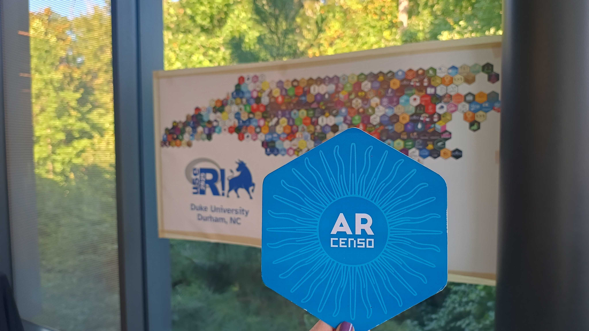
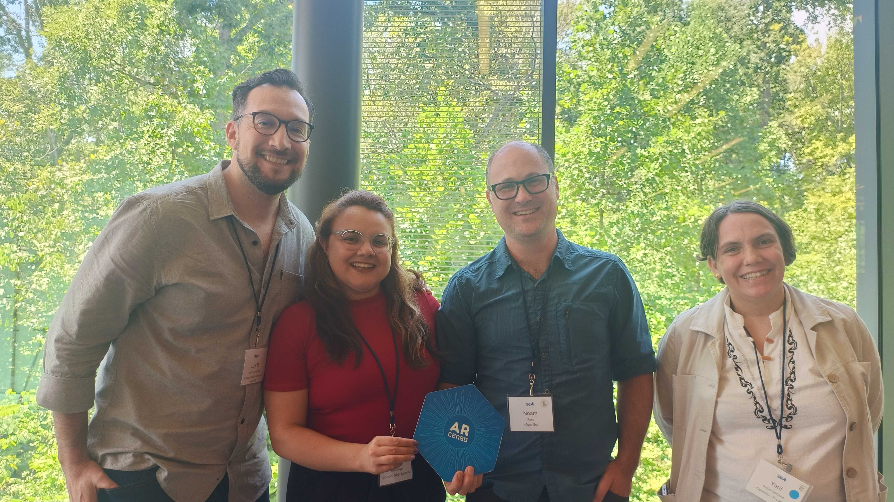

Del 8 al 10 de agosto de 2025 participé en useR! 2025, la conferencia internacional de usuarios de R, realizada de forma presencial en Duke University (Durham, North Carolina). Fue mi primera experiencia participando en persona, gracias al apoyo de Rconsortium, luego de haber presentado virtualmente en 2021 la charla [Uso de R en Latinoamérica: fortalezas, desafíos y debilidades](https://soyandrea.github.io/talleres/2021-useR-encuesta-r/).

Durante la conferencia asistí a dos talleres talleres, el primero: *Debugging Tools for Functions in R* con E. David Aja y Shannon Pileggi, y *Getting Started with Positron: A Next-Generation IDE for Data Science* con Jennifer Bryan y Julia Silge. Fueron dos experiencias muy valiosas para mi trabajo cotidiano, guiadas por referentes internacionales con muchísima experiencia y calidez.

### Charlas favoritas

Disfruté mucho en personas escuchar y compartir charlar sobre R para debatir y aportar a la convversación, mis keynotes favoritas:

-   [*Data in the Balance: Incentives, Independence, and Public Statistics* — **Frauke Kreuter** (LMU Munich / University of Maryland)](https://www.youtube.com/live/camPaY1g8hs?si=9MD6xHew0pRhQrUx)

-   [*We R Together. How to learn, use and improve a programming language as a community* — **Yanina Bellini Saibene** (rOpenSci, R-Ladies, Universidad Austral)](https://www.youtube.com/live/CTTvTQ-JZhw?si=1bes_NP7nZs281w5)

Además, disfruté muchísimo de las lightning talks:

-   [*Bringing the fun of hex stickers to your R session* — **Luis D. Verde Arregoitia** (Instituto de Ecología AC - INECOL)](https://youtu.be/shGOWlbquo4?si=GLKA2oNKE0IroyV1)
-   *Storytelling with ggplot2: Using custom functions to sequence visualizations* — **McCall Pitcher** (Duke University)
-   *tinytable: A lightweight package to create simple and configurable tables in a wide variety of formats* — **Vincent Arel-Bundock** (Université de Montréal)
-   *gfwr: an R package to access data from the Global Fishing Watch APIs* — **Andrea Sánchez-Tapia** (Global Fishing Watch)
-   *Rediscovering R for Library Data Instruction with Google Colab* — **Ahmad Pratama** (Stony Brook University)

### La sesión *Package lifecycle*

> Presentar `ARcenso` por primera vez en inglés, frente a una audiencia internacional, fue una experiencia que no voy a olvidar. Más allá del desafío, fue una oportunidad para ver cómo una iniciativa de datos censales puede inspirar, conectar y aportar a la comunidad open source.

Compartí espacio junto a Noam Ross, director de rOpenSci, y fue interesante ver cómo se conectan los proyectos en sus distintos niveles de experiencia, así como otros que también promueven la construcción colaborativa de paquetes en R. También estuvieron presentes Yanina Bellini, community manager de rOpenSci y coordinadora del programa de campeones, y Luis Verde, mi mentor en el programa, quienes junto al resto de los asistentes pudieron ver mi charla y conocer de cerca el crecimiento del proyecto.

Las charlas de esta sesión:

- *ARcenso: a Package Born From Chaos, Powered by Community* — Emanuel Ciardullo y Andrea Gómez Vargas

- *Curating a Community of Packages: Lessons from a Decade of rOpenSci Peer Review* — Noam Ross (rOpenSci)

- *rtables: Challenges, Advances and Lessons Learned Going Into Production At J&J* — Gabe Becker (Independent)

### Comunidad

Pude reencontrarme con colegas y amigos con quienes colaboro de forma online, y también participar del evento de networking de R-Ladies, donde conocí personas de distintas partes de Carolina del Norte, de Estados Unidos y del mundo. Fue una experiencia muy enriquecedora para descubrir historias, perfiles académicos y profesionales diversos, e invitarlos a seguir conectando y compartiendo.

<blockquote class="bluesky-embed" data-bluesky-uri="at://did:plc:xakkcpzucm7uhmsy3a2gh3g6/app.bsky.feed.post/3lwcdetxzn42z" data-bluesky-cid="bafyreigb7urwh3gcvf6mzuef3qj4kdrs3wy3oswqpxlt4ihlxjdok4wike" data-bluesky-embed-color-mode="system">
During useR! 2025, we had a special moment to gather at the R-Ladies meetup. It was a great opportunity to connect, share experiences, and keep strengthening our global community. 💜 

Find your local chapter and get involved: rladies.org/about-us/inv...

#useR2025  <a href="https://bsky.app/profile/did:plc:xakkcpzucm7uhmsy3a2gh3g6/post/3lwcdetxzn42z?ref_src=embed">[image or embed]</a>
&mdash; R-Ladies (<a href="https://bsky.app/profile/did:plc:xakkcpzucm7uhmsy3a2gh3g6?ref_src=embed">@rladies.org</a>) <a href="https://bsky.app/profile/did:plc:xakkcpzucm7uhmsy3a2gh3g6/post/3lwcdetxzn42z?ref_src=embed">13 de agosto de 2025, 14:17</a></blockquote>

Quiero agradecer especialmente a **Mine Çetinkaya-Rundel**, Chair de la conferencia y a **Heidi Seibold** del Comité Organizadory, por hacer posible mi asistencia, sin ellas esto no hubiera sido posible. 

Fue muy gratificante regresar a casa con tantas experiencias valiosas en tan poco tiempo. La oportunidad de encontrarnos en persona es única, y poder asistir gracias al apoyo de la comunidad tiene un valor enorme. En un contexto de fuertes limitaciones presupuestarias en Argentina, participar de este tipo de eventos representa un impulso muy significativo para mi trabajo, para la comunidad y para el desarrollo de mi ARcenso.

> Las presentaciones presenciales estarán disponibles en el [canal de YouTube de useR! Conference](https://www.youtube.com/@useRConference_global/videos).
