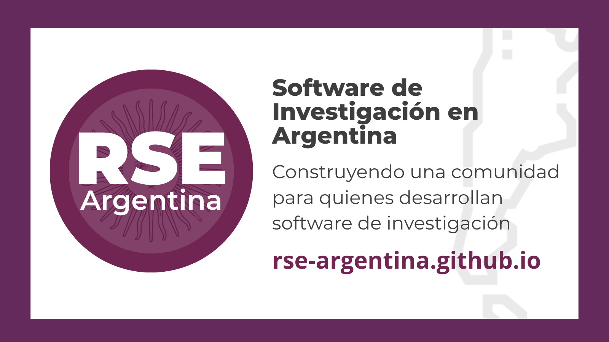
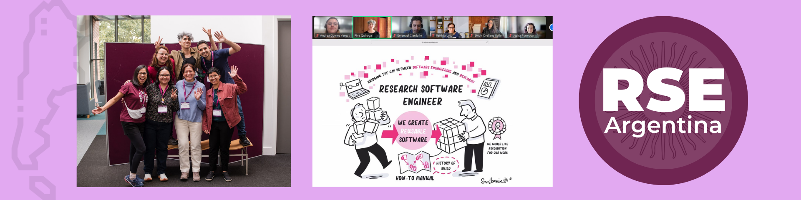

El *Research Software Engineering (RSE)* promueve buenas prácticas en el desarrollo de software para investigación, con foco en la reproducibilidad, la colaboración y la calidad del código en contextos científicos. En Argentina, estamos impulsando esta comunidad de práctica para acercar estas prácticas a quienes trabajan con datos, código e investigación, tanto en el ámbito académico como en el sector público.

[**RSE Argentina**](https://rse-argentina.github.io/) surge como un espacio para compartir experiencias locales, generar redes y construir comunidad en torno al software de investigación en español. A partir de encuentros abiertos, charlas y colaboraciones con otras comunidades, buscamos fortalecer el uso de herramientas abiertas y reproducibles, y acompañar a más personas en sus propios proyectos.

### Referencias y recorrido 

> [Mi experiencia en la RSECon25](https://soyandrea.github.io/comunidad/2025-RSECon25/)

> [RSE Day en Español #IntlRSEday](https://soyandrea.github.io/talleres/2025-RSEday/)