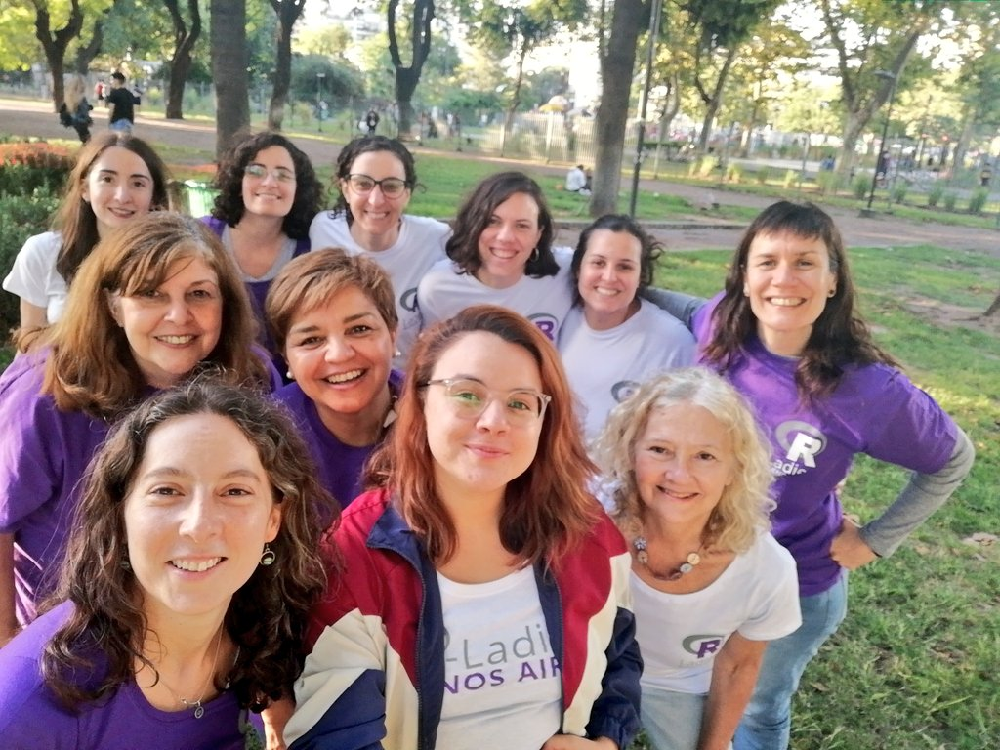

## Capítulo Buenos Aires



Desde 2019 me sumé como colaboradora y durante 2020 y 2023 como organizadora del capítulo en Buenos Aires, entre la presencialidad y la virtualidad hemos organizando variados encuentros con diferentes temáticas y participantes de distintas profesiones. Siendo un espacio interdisciplinario, horizontal y colectivo.

Encuentra en nuestro canal de youtube los encuentros virtuales que se han realizado. Y conoce lo realizado a nivel nacional en [**RLadies en Argentina durante 2020**](https://rladiesenargentina.github.io/Resumen_meetups_2020/index.html).

En 2022 cumplimos 5 años, festejamos con un (Re)encuentro presencial y con el lanzamiento de la página web [**rladiesba.netlify.app**](https://rladiesba.netlify.app/)

> No importa si nunca usaste R o si tenés R como herramienta principal de trabajo. El objetivo es promover R, intercambiar conocimiento y crear una red de contactos a nivel local y global.

<blockquote class="twitter-tweet">

<p lang="pt" dir="ltr">

Cara de deploy 😁🥳💜🥳<a href="https://twitter.com/hashtag/rladies?src=hash&amp;ref_src=twsrc%5Etfw">#rladies</a> <a href="https://t.co/CPu2txpS3U">pic.twitter.com/CPu2txpS3U</a>

</p>

— R-Ladies BuenosAires (@RLadiesBA) <a href="https://twitter.com/RLadiesBA/status/1516958038388666368?ref_src=twsrc%5Etfw">April 21, 2022</a>

</blockquote>

```{=html}
<script async src="https://platform.twitter.com/widgets.js" charset="utf-8"></script>
```
