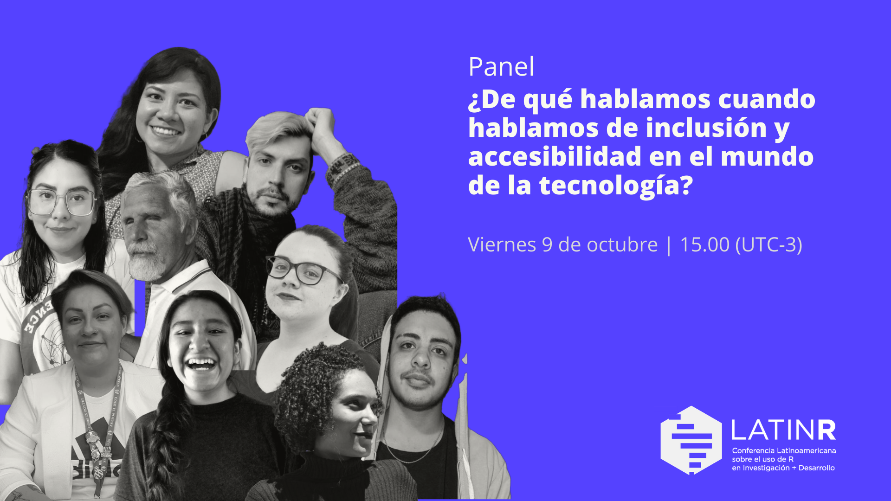

## ¿De qué hablamos cuando hablamos de inclusión y accesibilidad en el mundo de la tecnología?

En esta ocasión reunimos a integrantes de diferentes comunidades en latinoamérica que promueven y trabajan por la inclusión y accesibilidad en el mundo de la tecnología para que den a conocer su trabajo, sus objetivos, logros y desafíos a la hora de lograr una inclusión y accesibilidad real. Queremos generar un espacio de reflexión, donde podamos pensar en conjunto sobre la importancia de que la tecnología sea más inclusiva y accesible a todes y pensar a las comunidades como actores principales para llevar a cabo este objetivo.

Míralo en el canal de youtube de LatinR https://youtu.be/xkRFGbZocIU

**Modera:**

-   Andrea Gómez Vargas (LatinR - miembro comité organizador)

**Participan:**

-   Merary Alvarado (DALAT Desarrollo Accesible Latinoamericano)
-   Martín Baldasarre (DALAT Desarrollo Accesible Latinoamericano)
-   Abe Quiroga (Transistemas Argentina)
-   Coi Bressan (Transistemas Argentina)
-   Joselyn Chávez (R-Ladies Cuernavaca & R-Ladies México)
-   Milagros Villavicencio (R-Ladies Natal - Brasil)
-   Fernanda Kelly (R-Ladies Goiânia - Brasil)
-   Lupe Canaviri Maydana (Laboratoria & PyLadies El Alto - Bolivia)
