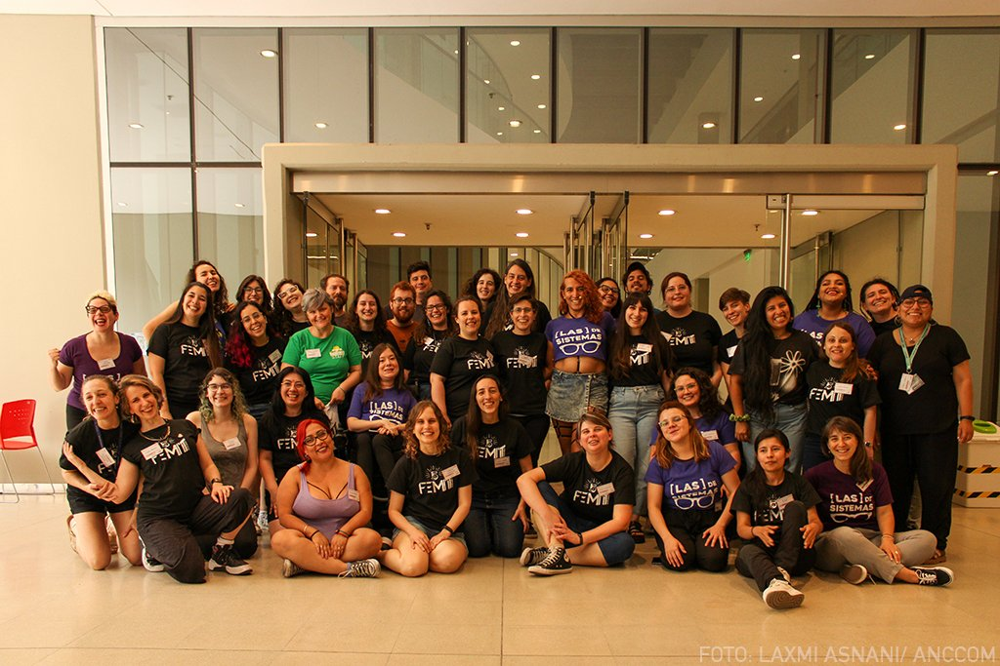

## Conferencia Argentina de tecnología y feminismo



*FemIT conf es una conferencia sobre tecnología con perspectiva de género organizada por [**\[LAS\] DE SISTEMAS**](https://lasdesistemas.org/). Es virtual, gratuita y abierta a todo público. El evento consta de charlas dictadas por mujeres, lesbianas, travestis, trans y no binaries cuya experiencia va desde primeras oportunidades presentando trabajos introductorios, hasta personalidades destacadas en sus áreas de estudio. La conferencia busca compartir conocimientos y visibilizar el trabajo de estos grupos minoritarios con el objetivo de potenciar a los mismos e inspirar a quienes participan.*

Con ocho meses de planificación y con el trabajo de más de 40 personas voluntarias, se llevó adelante la quinta edición de la FemIt Conf en formato híbrido. Participé en el equipo de logistica como voluntaria coordinando la agenda y tiempos de presentación en el vivo con las host del evento durante la jornada. Sin todo un colectivo, nada de esto hubiera sido posible.

<blockquote class="twitter-tweet">

<p lang="es" dir="ltr">

¡Denle amor a este equipo de presentadoras de <a href="https://twitter.com/hashtag/FemITConf22?src=hash&amp;ref_src=twsrc%5Etfw">#FemITConf22</a>! <a href="https://t.co/Vhhshhs7om">pic.twitter.com/Vhhshhs7om</a>

</p>

— FemIT Conf (@femitconf) <a href="https://twitter.com/femitconf/status/1591485703036481536?ref_src=twsrc%5Etfw">November 12, 2022</a>

</blockquote>

```{=html}
<script async src="https://platform.twitter.com/widgets.js" charset="utf-8"></script>
```

### Redes

<blockquote class="twitter-tweet">

<p lang="es" dir="ltr">

👩‍💻 ​“En un mundo de ceros y unos, vamos por la diversidad”, se observó en la bandera de <a href="https://twitter.com/lasdesistemas?ref_src=twsrc%5Etfw">@lasdesistemas</a>, comunidad transfeminista de mujeres, lesbianas, travestis, trans y no binaries, que trabaja en la industria tecnológica.<br><br>Leé la nota completa acá 👉 <a href="https://t.co/SqeKf0sy19">https://t.co/SqeKf0sy19</a> <a href="https://t.co/IwJXTzVzy4">pic.twitter.com/IwJXTzVzy4</a>

</p>

— ANCCOM (@AnccomNoticias) <a href="https://twitter.com/AnccomNoticias/status/1593305068635316224?ref_src=twsrc%5Etfw">November 17, 2022</a>

</blockquote>

```{=html}
<script async src="https://platform.twitter.com/widgets.js" charset="utf-8"></script>
```
