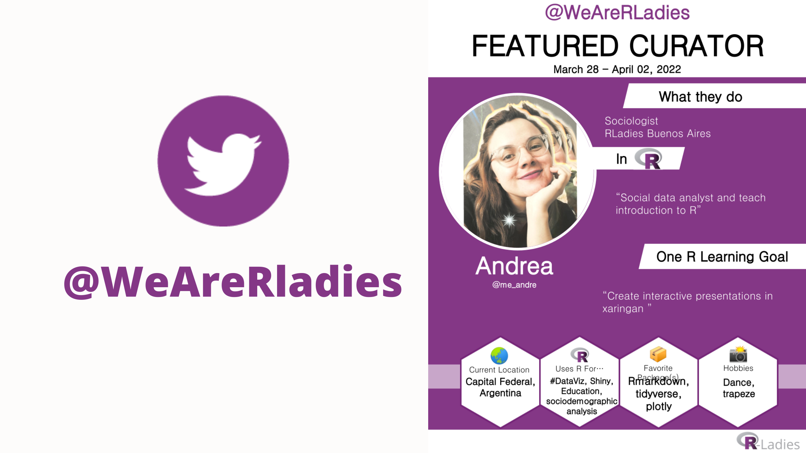

## RoCur We Are R-Ladies twitter/X en Español



Cada lunes en la cuenta de [**\@WeAreRladies**](https://twitter.com/WeAreRLadies) alguna rladie de la comunidad es curadora de la cuenta global, a finales marzo tomé el desafío de participar en un idioma diferente y en especial, hablar sobre R desde mi experiencia en el Sur Global y la Sociología.

Abordé tres temáticas en R: accesibilidad, ciencias sociales y la comunidad. Compartí información y tips para crear presentaciones o informes accesibles desde R, conté algunos proyectos de temática en ciencias sociales que trabajaron todo en código R y difundí todos los eventos virtuales de rladies a nivel mundial.

<blockquote class="twitter-tweet">

<p lang="en" dir="ltr">

After amazing years of R-Lady curation, and a period on hiatus, we are leaving this platform. Reconnect with us on Bluesky where we hope to reignite the spark!<a href="https://t.co/0E3aFvrehH">https://t.co/0E3aFvrehH</a><br><br>An archive of all past activity of this account can be found at <a href="https://t.co/7ROZPGUVUo">https://t.co/7ROZPGUVUo</a>

</p>

— We are R-Ladies (@WeAreRLadies) <a href="https://twitter.com/WeAreRLadies/status/1858173440433569929?ref_src=twsrc%5Etfw">November 17, 2024</a>

</blockquote>

```{=html}
<script async src="https://platform.twitter.com/widgets.js" charset="utf-8"></script>
```
