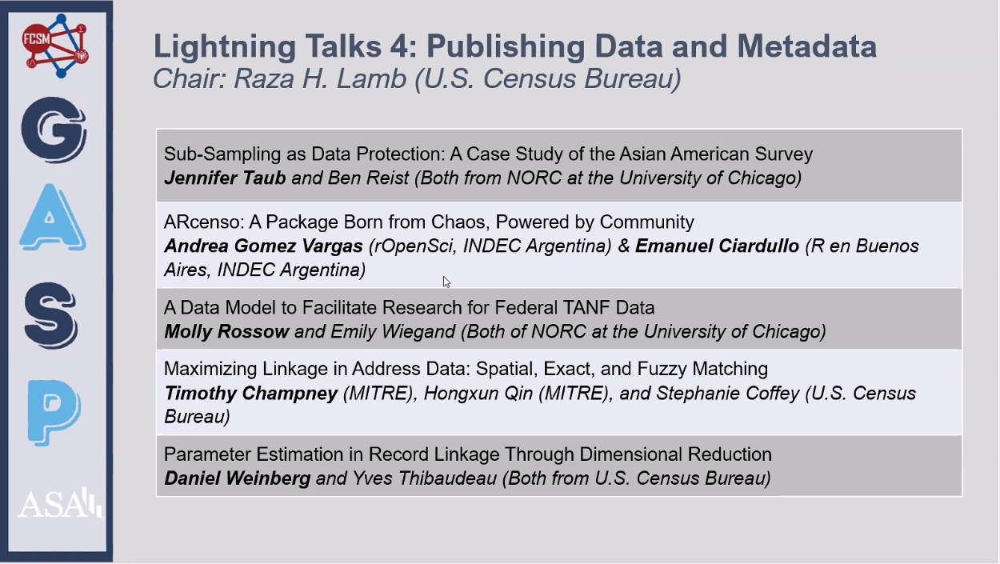

# ARcenso: a Package Born From Chaos, Powered by Community 📦

### Lightning Talks: Publishing Data and Metadata

<br>

Estuvimos contando sobre arcenso en GASP 2025, un evento virtual que se realizó del 24 al 26 de junio y reunió a más de 100 personas por día de distintos ámbitos: gobierno, academia e industria, todas interesadas en el uso de estadísticas públicas. Fue una gran oportunidad para compartir este proyecto con personas que trabajan con datos censales en Estados Unidos, como integrantes del Census Bureau o investigadoras de universidades como la de Chicago. Presentamos cómo arcenso busca ordenar y hacer accesibles los datos del censo argentino a través de un paquete en R, pensado para facilitar su uso por parte de funcionariado, investigadoras y la ciudadanía en general. También compartimos cómo la comunidad R fue clave para desarrollar esta herramienta: desde aprender buenas prácticas hasta recibir apoyo e inspiración para transformar el caos en un recurso útil para todas las personas que trabajan con datos.


### Oradores

-   [Andrea Gomez Vargas](https://github.com/SoyAndrea)
-   [Emanuel Ciardullo](https://github.com/ECiardullo)


### Programa de la sesión

{width=70%} 


### Apoyan 

:::::: columns
::: {.column width="50%"}


El evento fue patrocinado por el grupo Data Science for Federal Statistics (DSFS) —parte del Federal Committee on Statistical Methodology (FCSM)— y organizado con el apoyo de la American Statistical Association (ASA). 


:::

::: {.column width="1%"}
:::

::: {.column width="40%"}

{width=70%}

{width=70%}

:::
::::::


### Slides

```{r echo=FALSE}
knitr::include_url("https://eciardullo.github.io/arcenso-GASP25/",height = 400)
```


### Links de interés

-   GASP home <https://community.amstat.org/gasp/home>
-   [web ARcenso](https://soyandrea.github.io/arcenso/)
-   [repositorio en GitHub de ARcenso](https://github.com/SoyAndrea/arcenso)
-   slides en Quarto [eciardullo.github.io/arcenso-GASP25](https://eciardullo.github.io/arcenso-GASP25/#/title-slide)
-   [rOpenSci Champions Program - Andrea Gomez Vargas](https://ropensci.org/blog/2024/02/15/champions-program-champions-2024/#andrea-gomez-vargas)
