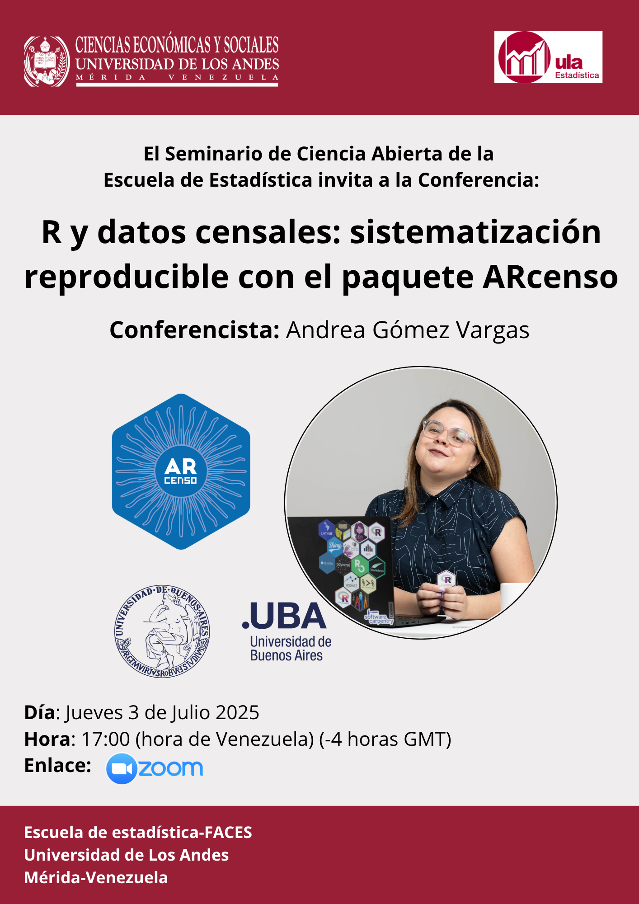

## R y datos censales: sistematización reproducible con el paquete `ARcenso`

### Charla virtual

:::::: columns
::: {.column width="50%"}
Fui invitada a dar una charla en el Seminario de la Universidad de Los Andes (ULA) de Mérida, Venezuela, donde presenté el paquete ARcenso a estudiantes y graduado en Estadística. Compartí cómo surgió el proyecto a partir de la necesidad de transformar cientos de archivos dispersos en un recurso accesible y censales.

Participaron alrededor de 25 personas de Venezuela, Argentina y otros países de la región, con mucho interés en discutir sobre datos reproducibles y en encontrar formas de trabajo más eficaces y colaborativas.

💛 Un agradecimiento especial a *Anavelyz Pérez* por la invitación y la calidez con la que me recibió en el espacio.
:::

::: {.column width="10%"}
:::

::: {.column width="40%"}

:::
::::::

### Slides

```{r echo=FALSE}
knitr::include_url("https://soyandrea.github.io/arcenso-ULA/#/title-slide",height = 400)
```

### Links de interés

-   [web ARcenso](https://soyandrea.github.io/arcenso/)
-   [repositorio en GitHub de ARcenso](https://github.com/SoyAndrea/arcenso)
-   slides en Quarto [soyandrea.github.io/arcenso-ULA](https://soyandrea.github.io/arcenso-ULA/#/title-slide)
