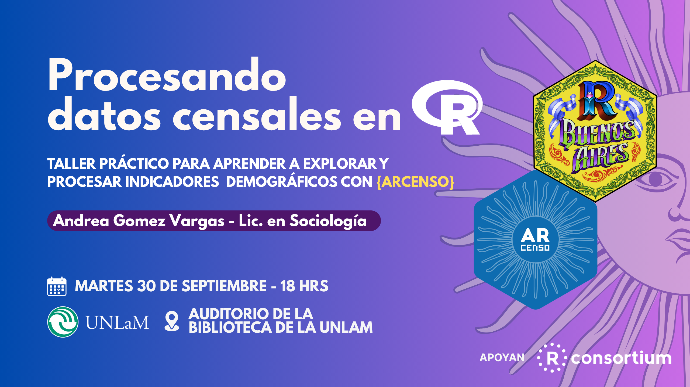
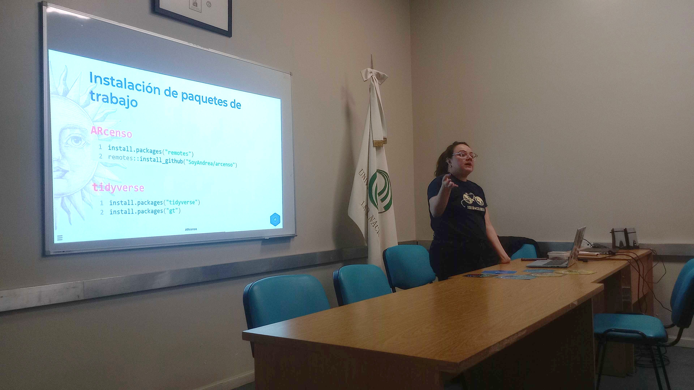
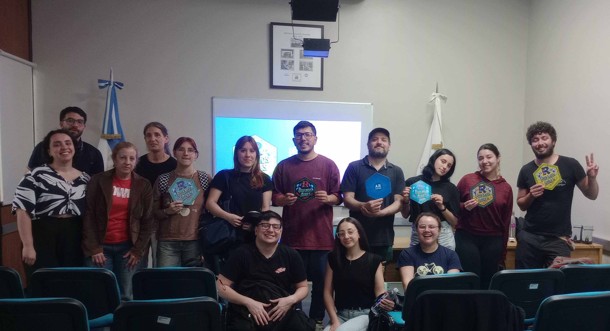
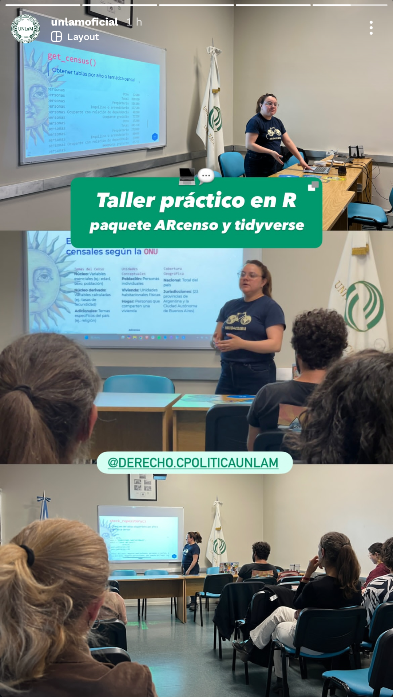

## Taller práctico para aprender a explorar y procesar indicadores demográficos con los paquetes `ARcenso` y `tidyverse`.

::::: columns
::: {.column width="50%"}

{width="100%"}

:::

::: {.column width="50%"}
 

{width="100%"}


:::
:::::

<br>

Nos reunimos en el auditorio de la biblioteca de la Universidad Nacional de La Matanza (UNLaM), invitada por la materia Demografía Social de la carrera de Ciencia Política y organizado en conjunto con [R en Buenos Aires](https://renbaires.github.io/).


La idea fue explorar los datos del Censo Nacional de Población, Viviendas y Hogares como fuente de información y usar el paquete de datos `ARcenso` como ejemplo de paquete de datos conn información histórica del Censo 1970, sumando distintas funciones de `tidyverse` y `gt` al flujo de trabajo en ciencia de datos. Se sumaron más de diez personas, con muchas ganas de aprender y de practicar.

<br>


{width="70%" fig-align="center"}

<br>

Durante la práctica nos enfocamos en construir el indicador de estructura de la población, y paso a paso fuimos importando los datos, revisándolos y calculando la distribución por grupo quinquenal y sexo con `dplyr`.

Como resultado, llegamos a una pirámide poblacional del Censo 1970 de la provincia de Buenos Aires realizada con `ggplot2`, acompañada por una tabla de datos en `gt`. Fue una experiencia muy enriquecedora, donde el interés por los datos censales y el entusiasmo por aprender R se combinaron en un espacio de trabajo colaborativo.

### Social media


::::: columns
::: {.column width="40%"}
{width="100%"}
:::

::: {.column width="55%"}
<blockquote class="twitter-tweet">

<p lang="es" dir="ltr">

📸 Así vivimos nuestro último taller de Procesando datos censales en R.<br><br>Gracias a la <a href="https://twitter.com/UnlamOficial?ref_src=twsrc%5Etfw">@UnlamOficial</a> por el espacio y a todas las personas que se sumaron 🙌 <a href="https://twitter.com/hashtag/Rstats?src=hash&amp;ref_src=twsrc%5Etfw">#Rstats</a> <a href="https://t.co/Kg5pSarxZZ">pic.twitter.com/Kg5pSarxZZ</a>

</p>

— R en Buenos Aires (@renbaires) <a href="https://twitter.com/renbaires/status/1973372279758397583?ref_src=twsrc%5Etfw">October 1, 2025</a>

</blockquote>

:::
:::::

### Slides

```{r echo=FALSE}
knitr::include_url("https://soyandrea.github.io/arcenso-unlam/#/title-slide",height = 400)
```


```{=html}
<script async src="https://platform.twitter.com/widgets.js" charset="utf-8"></script>
```

### Links de interés

-   Ejercicio de practica demográfica [practica-censo.netlify.app](https://practica-censo.netlify.app/)
-   [web ARcenso](https://soyandrea.github.io/arcenso/)
-   [repositorio en GitHub de ARcenso](https://github.com/SoyAndrea/arcenso)
-   slides en Quarto [soyandrea.github.io/arcenso-unlam](https://soyandrea.github.io/arcenso-unlam/#/title-slide)
