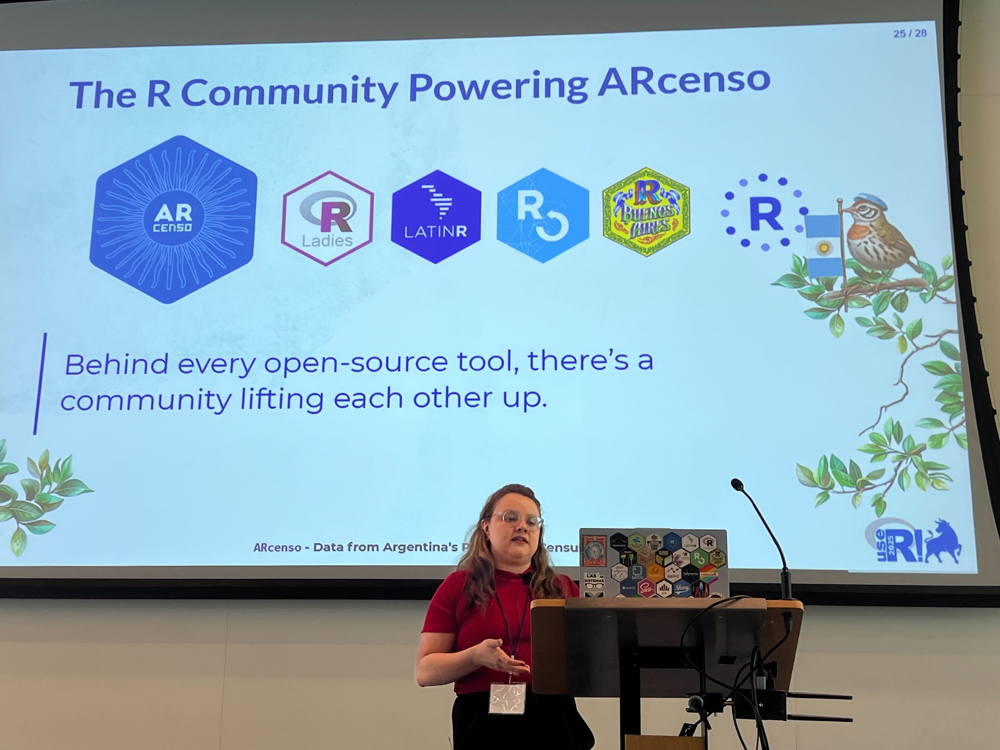
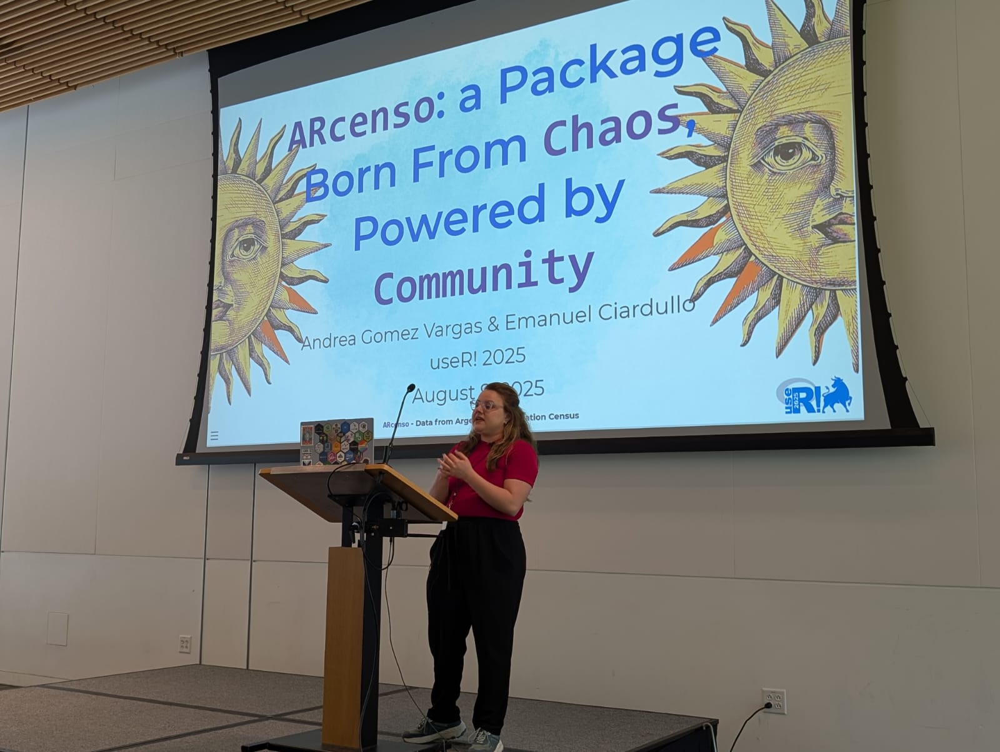
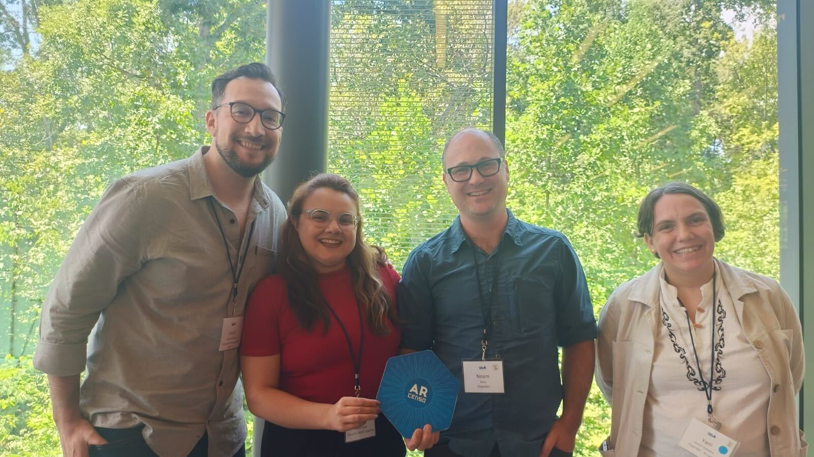
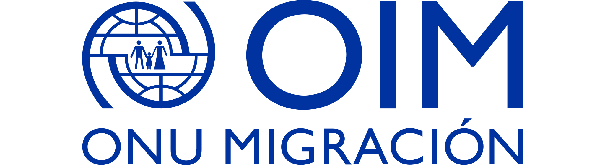

## `ARcenso`: a Package Born From `Chaos`, Powered by `Community`

### Session talk: Package lifecycle

-   Speaker & Co-author: [Andrea Gomez Vargas](https://github.com/SoyAndrea)
-   Co-author: [Emanuel Ciardullo](https://github.com/ECiardullo)

{width="100%"}


Presentar ARcenso en useR! fue una experiencia enorme para mí: era mi primera vez exponiendo en Estados Unidos, en inglés y en persona, lo que implicaba un gran desafío interno. Gracias al apoyo del R Consortium y al programa de movilidad de la OIM pude estar allí y compartir el paquete con la comunidad global de R.

:::::: columns
::: {.column width="50%"}
En la charla mostré el origen de ARcenso, su propuesta, su equipo y el trabajo a futuro. Además del desafío de organizar datos censales en R, compartí cómo muchos de los problemas que enfrentamos —archivos de Excel desordenados, la necesidad de estandarizar y de facilitar el acceso a la información— son comunes más allá del tema censal.

Fue un lujo coincidir en persona con parte del equipo de rOpenSci —incluido mi mentor Luis Verde, la community manager Yanina Bellini y el director Noam Ross— y mostrar cómo el proyecto se fue fortaleciendo con el tiempo y cómo la comunidad de R jugó un rol excepcional en ese proceso. Me llevo el aprendizaje de que somos muchas personas trabajando con datos censales y que es un tema relevante a nivel global, además de la alegría de sumar comunidad y llevar la bandera de ARcenso y de R en Buenos Aires a un escenario internacional.
:::

::: {.column width="10%"}
:::

::: {.column width="40%"}



:::
::::::

### Presentación

```{r echo=FALSE}
knitr::include_url("https://soyandrea.github.io/arcenso-useR2025/#/title-slide",height = 300)
```

### Presentación en youtube

<iframe width="560" height="315" src="https://www.youtube.com/embed/5iujHzMTvZA?si=VttGywqGJvnxzJfr" title="YouTube video player" frameborder="0" allow="accelerometer; autoplay; clipboard-write; encrypted-media; gyroscope; picture-in-picture; web-share" referrerpolicy="strict-origin-when-cross-origin" allowfullscreen>

</iframe>

### Quarto theme

Este tema de Quarto fue diseñado y desarrollado por [Ariana Bardauil](https://github.com/ariibard) específicamente para esta presentación. Su uso es posible gracias a su permiso, ya que por el momento no está disponible públicamente.

Estoy muy agradecida con Ariana por su creatividad y dedicación en el diseño de este tema, que le aporta una identidad visual única al proyecto.

### Helpful links

-   R package website <https://soyandrea.github.io/arcenso/>

-   ARcenso Github <https://github.com/SoyAndrea/arcenso>

-   slides [soyandrea.github.io/arcenso-useR2025](https://soyandrea.github.io/arcenso-useR2025/#/title-slide)

-   rOpenSci Program <https://ropensci.org/blog/2024/02/15/champions-program-champions-2024/#andrea-gomez-vargas>

### Agradecimientos

Gracias al apoyo económico de R consortium y al programa de movilidad de la OIM, no hubiera sido posible llegar a esta edición de useR!. Haber podido compartir ARcenso en este espacio me recordó lo importante que es el apoyo comunitario para que proyectos abiertos sigan creciendo y lleguen más lejos.


{width="50%"}
