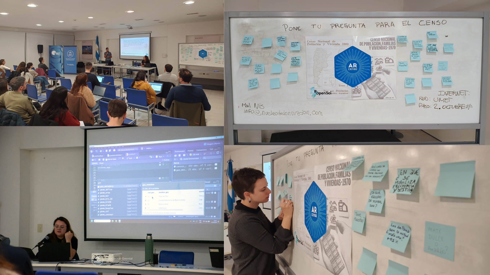
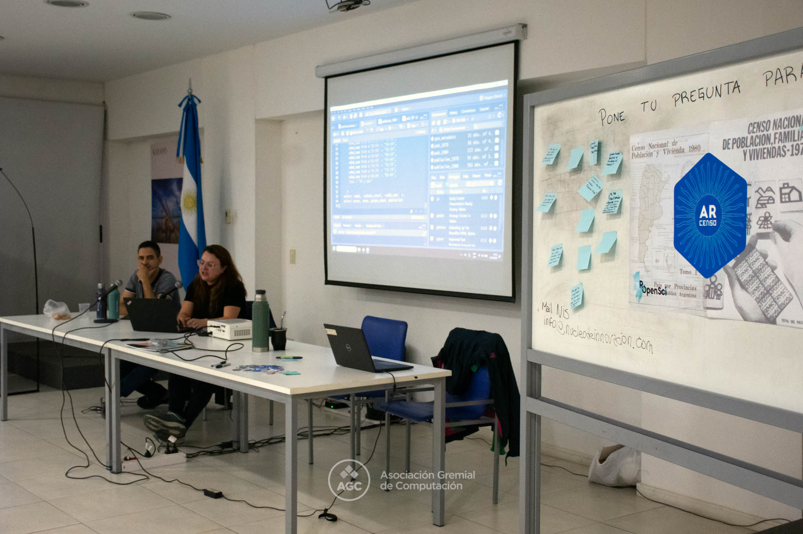

Brindamos de manera presencial un taller práctico en R junto a [Emanuel Ciardullo](https://github.com/ECiardullo), en una actividad organizada en conjunto con la Universidad Metropolitana para la Educación y el Trabajo(UMET) y la Licenciatura en Informática de la universidad. La charla fue impulsada por el Núcleo de Innovación Social (NIS), quienes nos convocaron para presentar ARcenso y explorar cómo acceder a tablas históricas de los censos de Argentina. Durante la jornada trabajamos con datos censales reales, mostrando cómo buscar, organizar y analizar información histórica de forma reproducible en R.





El taller estuvo basado en la [**vignette “Construyendo indicadores demográficos”**](https://soyandrea.github.io/arcenso/articles/indicadores_demograficos.html), donde construimos distintos indicadores como el *índice de envejecimiento, el índice de feminidad por grupos de edad y el índice de Whipple*, además de analizar la estructura de la población para comparar los censos de 1970 y 1980. Nos acompañaron más de 20 personas interesadas en aprender nuevas herramientas para el análisis de datos sociales y demográficos.


Fue un encuentro muy especial, con mucha participación, preguntas e intercambio entre quienes se acercaron a conocer el paquete y descubrir todo lo que puede construirse a partir de los datos censales. Ver el interés y la curiosidad de tantas personas nos hizo sentir que ARcenso sigue creciendo como un proyecto comunitario, conectado con el espíritu del software libre y el trabajo abierto que impulsa rOpenSci.


## Presentación 


```{r echo=FALSE}
knitr::include_url("https://soyandrea.github.io/arcenso-umet-nis/#/title-slide",height = 400)
```


### Links de interés

- [web ARcenso](https://soyandrea.github.io/arcenso/)
- [vignette Construyendo indicadores demográficos de ARcenso](https://soyandrea.github.io/arcenso/articles/indicadores_demograficos.html)
- [Nuevas redes entre comunidades: taller sobre datos censales y R en la UMET](https://informaticos.ar/nuevas-redes-entre-comunidades-taller-sobre-datos-censales-y-r-en-umet/)
- [Núcleo de Innovación Social: Taller práctico en R en UMET junto a AGC TI y R Buenos Aires](https://nucleodeinnovacionsocial.com.ar/charlas/2026-05-meetup-arcenso/)


