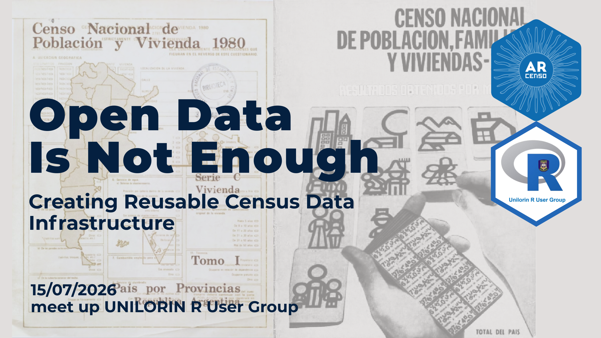

## Creating Reusable Census Data Infrastructure



En esta actividad brindé la charla “Open Data Is Not Enough: Creating Reusable Census Data Infrastructure”, en la que compartí los aprendizajes obtenidos durante el desarrollo de arcenso. La presentación partió de una idea central: publicar datos de forma abierta es fundamental, pero no es suficiente para garantizar que puedan ser utilizados.

A partir de la experiencia de trabajar con datos censales históricos de Argentina, hablé sobre las dificultades que aparecen cuando la información se encuentra dispersa en publicaciones, archivos Excel, PDF y otros formatos. También compartí las decisiones y procesos necesarios para transformar esos datos en recursos más accesibles, interoperables, reutilizables y reproducibles, así como la importancia de las comunidades de código abierto en la construcción de este tipo de infraestructura.

No quiero dejar de agradecer al equipo organizador por la invitación y, especialmente, a Ezekiel, con quien compartí el programa rOpenSci Champions 2023–2024. Este encuentro también refleja uno de los aspectos más valiosos del programa: los vínculos que se construyen durante la cohorte continúan en el tiempo y nos permiten seguir en contacto, intercambiar experiencias y generar nuevas oportunidades de colaboración.

En esta parte podes encontra el video de la sesión y la presentación. 

### Presentación en youtube

<iframe width="560" height="315" src="https://www.youtube.com/embed/TEHYZ5uoUB4?si=CDdsW4bKpebddMEa" title="YouTube video player" frameborder="0" allow="accelerometer; autoplay; clipboard-write; encrypted-media; gyroscope; picture-in-picture; web-share" referrerpolicy="strict-origin-when-cross-origin" allowfullscreen></iframe>

### Slides

```{r echo=FALSE}
knitr::include_url("https://soyandrea.github.io/arcenso-unilorin/#/title-slide",height = 400)
```