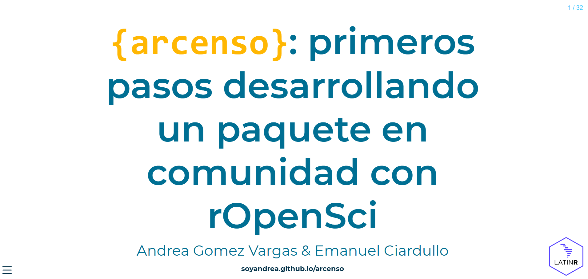

# {ARcenso}: primeros pasos desarrollando un paquete en comunidad con rOpenSci 📦



### Panel: Proceso de desarrollo de paquetes

En esta charla compartimos la experiencia de armar un paquete desde cero acompañados por rOpenSci y toda su comunidad, con las capacitaciones, la mentoría 1:1 y la sesiones de coworking que delimitaron los puntos de partida y estrategias para el armado del proyecto, la toma de decisiones, el armado conceptual, los desafíos y aprendizajes a la hora de construir un paquete, las primeras funciones y la hoja de ruta para incorporar los seis periodos censales.

### Oradores

-   [Andrea Gomez Vargas](https://github.com/SoyAndrea)
-   [Emanuel Ciardullo](https://github.com/ECiardullo)

### Presentación



### Slides

```{r echo=FALSE}
knitr::include_url("https://soyandrea.github.io/arcenso-latinR2024/",height = 400)
```

### Social media

<blockquote class="twitter-tweet">

<p lang="es" dir="ltr">

No estoy llorando, este bebé salió a la luz en <a href="https://twitter.com/LatinR_Conf?ref_src=twsrc%5Etfw">@LatinR_Conf</a> en su primer versión en github <a href="https://t.co/pVF8JB2DFt">https://t.co/pVF8JB2DFt</a> 💜<a href="https://twitter.com/hashtag/rstats?src=hash&amp;ref_src=twsrc%5Etfw">#rstats</a><a href="https://twitter.com/hashtag/LatinR2024?src=hash&amp;ref_src=twsrc%5Etfw">#LatinR2024</a> <a href="https://t.co/DyLiUHTFSz">pic.twitter.com/DyLiUHTFSz</a>

</p>

— andrea (@me_andre) <a href="https://twitter.com/me_andre/status/1859244999243657685?ref_src=twsrc%5Etfw">November 20, 2024</a>

</blockquote>

```{=html}
<script async src="https://platform.twitter.com/widgets.js" charset="utf-8"></script>
```

### Links de interés

-   [web ARcenso](https://soyandrea.github.io/arcenso/)
-   [repositorio en GitHub de ARcenso](https://github.com/SoyAndrea/arcenso)
-   slides en Quarto [soyandrea.github.io/arcenso-latinR2024/](https://soyandrea.github.io/arcenso-latinR2024/)
-   [rOpenSci Champions Program - Andrea Gomez Vargas](https://ropensci.org/blog/2024/02/15/champions-program-champions-2024/#andrea-gomez-vargas)
