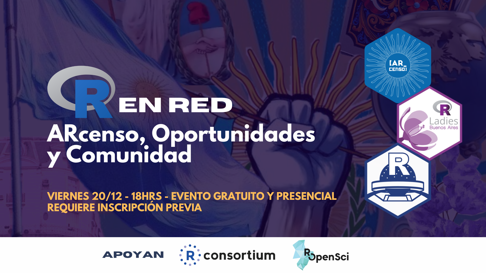

# {ARcenso}📦 - Data from Argentina’s Population Census

#### Charla [R-Ladies Buenos Aires](https://github.com/RLadies-BA) & [R en Buenos Aires](https://github.com/renbaires) 

 

### Oradores

-   [Andrea Gomez Vargas](https://github.com/SoyAndrea)
-   [Emanuel Ciardullo](https://github.com/ECiardullo)

### Resumen:

Presentamos el paquete `ARcenso` a la comunidad de usuarios de la ciudad de Buenos Aires, Desde la idea hasta las primeras funciones disponibles, y del acompañamiento en comunidad como parte del programa de campeones y campeonas del software de rOpenSci.

:::::: columns
::: {.column width="45%"}
<blockquote class="twitter-tweet">

<p lang="es" dir="ltr">

Gracias a todes por este increíble meet up junto a <a href="https://twitter.com/RLadiesBA?ref_src=twsrc%5Etfw">@RLadiesBA</a> 💜. R en Red 🌟<a href="https://twitter.com/hashtag/RStats?src=hash&amp;ref_src=twsrc%5Etfw">#RStats</a> <a href="https://t.co/viz1tSE7iZ">pic.twitter.com/viz1tSE7iZ</a>

</p>

— R en Buenos Aires (@renbaires) <a href="https://twitter.com/renbaires/status/1870566237031616872?ref_src=twsrc%5Etfw">December 21, 2024</a>

</blockquote>

```{=html}
<script async src="https://platform.twitter.com/widgets.js" charset="utf-8"></script>
```
:::

::: {.column width="10%"}
:::

::: {.column width="45%"}
<blockquote class="twitter-tweet">

<p lang="es" dir="ltr">

La evolución de los logos del Censo 🇦🇷 <a href="https://t.co/gjM4e0RS8s">pic.twitter.com/gjM4e0RS8s</a>

</p>

— R-Ladies BuenosAires (@RLadiesBA) <a href="https://twitter.com/RLadiesBA/status/1870224531710742853?ref_src=twsrc%5Etfw">December 20, 2024</a>

</blockquote>

```{=html}
<script async src="https://platform.twitter.com/widgets.js" charset="utf-8"></script>
```
:::
::::::

### Slides

```{r echo=FALSE}
knitr::include_url("https://soyandrea.github.io/arcenso-RenBA",height = 400)
```

### Links de interés

-   [web arcenso](https://soyandrea.github.io/arcenso/)
-   [repositorio en GitHub de arcenso](https://github.com/SoyAndrea/arcenso)
-   slides [soyandrea.github.io/arcenso-RenBA/](https://soyandrea.github.io/arcenso-RenBA)
-   [rOpenSci Champions Program - Andrea Gomez Vargas](https://ropensci.org/blog/2024/02/15/champions-program-champions-2024/#andrea-gomez-vargas)
