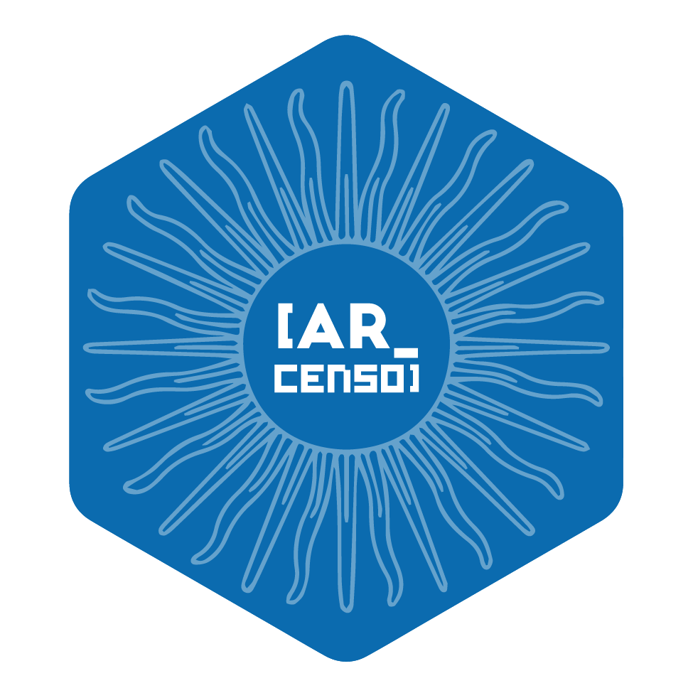

## Perfil Profesional

Analista de datos con formación en sociología y estadística, con más de cinco años de experiencia trabajando con encuestas, censos y grandes volúmenes de datos. Me especializo en análisis descriptivo, segmentación y visualización para transformar información compleja en insights claros que apoyan la toma de decisiones en distintos contextos.

:::  hex-card
[Download CV (PDF)](documentos/GOMEZ VARGAS ANDREA CV.pdf)
:::

## Experiencia profesional

**Analista de Estadísticas Poblacionales, INDEC (2021 – actualidad)**

*Rol en la Dirección Nacional de Estadísticas Sociales y de Población. Buenos Aires.*  

Trabajo en el diseño y desarrollo de procesos integrados de análisis en R para el procesamiento de información proveniente de censos, encuestas y registros administrativos, utilizando R y SQL. Desarrollo indicadores sociodemográficos a nivel nacional, que se integran en publicaciones estadísticas e instrumentos digitales interactivos (como tableros), diseñados de forma complementaria para facilitar su acceso, análisis y difusión.

> Mi trabajo se centra en estadísticas sociales y de población, con foco en la reproducibilidad, los datos abiertos y la comunicación accesible.

::: concise
*Publicaciones:*

-   [Shiny app - Sistema Integrado de Estadísticas Sociales (SIES)](https://shiny.indec.gob.ar/sies/)
-   [Shiny app - Tablero personas mayores](https://shiny.indec.gob.ar/tablero_pm/)
-   [Publicación Síntesis de resultados - Censo 2022](https://censo.gob.ar/index.php/censo-2022-sintesis-de-resultados/)
-   [Dosier Estadístico Día Internacional de la Mujer](https://www.indec.gob.ar/ftp/cuadros/publicaciones/dosier_estadistico_8M_2023.pdf)
-   [Dosier Estadístico de personas mayores](https://www.indec.gob.ar/ftp/cuadros/poblacion/dosier_personas_mayores_2023.pdf)
-   [Dosier Estadístico de niñas, niños y adolescentes](https://www.indec.gob.ar/ftp/cuadros/poblacion/dosier_nnya_11_237A4EFD2B08.pdf)
-   [Encuesta Nacional de Uso del Tiempo 2021. Resultados](https://www.indec.gob.ar/ftp/cuadros/sociedad/enut_2021.pdf)
:::

### Consultorías

-   **Fundación Huésped: Prevención - Ciencia - Derechos**

Analisis de datos y elaboración de reporte de Resultados Encuesta de Salud para Personas Migrantes 2024

Buenos Aires

01/08/2024 - 30/09/2024

-   **Dirección General de Inserción Laboral de la Mujer, Gobierno de la Ciudad de Buenos Aires**

Elaboración de capacitación Mujeres & IT para el Programa de habilidades para la empleabilidad.

Buenos Aires

01/03/2023 – 31/10/2023

-   **Organización de Estados Iberoamericanos, Oficina Nacional Argentina**

Analista de datos en Programa de Fortalecimiento para el desarrollo, preservación y promoción de la Cultura Argentina.

Buenos Aires

01/10/2022 – 31/01/2023

-   **Cámara Argentina del Libro**

Procesamiento, análisis y presentación de datos para informe básico semestral producción del libro argentino

Buenos Aires

01/08/2022 – 30/09/2022

-   **CEIS Consultora**

Analista en proyectos de investigación cuantitativa sobre mercado de trabajo. Recolección de información y procesamiento de datos en R.

Buenos Aires

01/05/2021 – 30/06/2021

### Experiencia docente

-   Consejo Nacional de Investigaciones Científicas y Técnicas - CONICET, **Docente**. Curso Aplicaciones interactivas con R y Shiny para investigación. Buenos Aires - Virtual. 2025

-   Universidad Nacional Guillermo Brown, **Docente adjunta dedicación simple**. Materia Visualización de la Información - carrera de grado ciencia de datos. Buenos Aires - Virtual. 2023-2024.

-   Universidad Nacional de San Martín, **Profesora de Posgrado**. Diplomatura en Ciencias Sociales Computacionales y Humanidades Digitales. Buenos Aires - Virtual. 2023.

-   Asociación Argentina de Especialistas en Estudios del Trabajo, **Docente**. Curso de Introducción al Procesamiento de Datos con R edición 2022 & 2023. Virtual. 2022-2023.

-   Facultad Latinoamericana de Ciencias Sociales (FLACSO), **Tutora técnico-pedagógica**. Curso de Posgrado Big Data e Inteligencia Territorial. Virtual. 2022-2021.

## Desarrollo de Software 📦

::::: columns
::: {.column width="30%"}
{width="80%"}
:::

::: {.column width="70%"}
**ARcenso**: paquete en R con datos censales de población Argentina.

Desarrolladora principal [github.com/SoyAndrea/arcenso](https://github.com/SoyAndrea/arcenso/)

Buenos Aires - 2024

> [soyandrea.github.io/conoce-arcenso](https://soyandrea.github.io/conoce-arcenso.html)
:::
:::::

## Formación profesional

-   **Maestría en Generación y Análisis de Información Estadística**

Universidad Nacional Tres de Febrero (UNTREF). Buenos Aires. 2024-actualidad.

-   **Licenciatura en Sociología**

Universidad de Buenos Aires (UBA). Buenos Aires. 2020.

### Cursos y capacitaciones

-   *Curso de Minería de datos con Python.* UTN. Buenos Aires. 2025

-   *Ciclo de formaciones en SQL: Bases de datos con SQL & selecciones avanzadas en SQL ORACLE* INDEC. Buenos Aires. 2023

-   *Diseño y construcción de indicadores & Estadísticas Sociales 2.* DANE Colombia. Virtual. 2023

-   *Aplicación del Sistema de Información Geográfica (SIG) en el análisis de indicadores sociodemográficos.* INDEC. Buenos Aires. 2022

-   *Accesiblidad web: introducción y pautas & técnicas y herramientas para mejorarla.* INAP. Virtual. 2022

-   *Social Data Analytics.* Escuela Argentina de Nuevas Tecnologías. Virtual. 2021

### Becas

-   [RSECon25 – Bursaries](https://rsecon25.society-rse.org/bursaries/)

Scholarship awarded to attend the Research Software Engineer Conference 2025 (RSECon25) in the UK, covering event registration, Coventry, 2025.

-   [R Developer Day Scholarship - University of Warwick](https://rsecon25.society-rse.org/r-dev-day-rsecon25/)

Scholarship awarded for in-person participation in RDev Day, a satellite event of RSECon25 in the UK, contributing to R development and collaborating with the international community, Coventry, 2025.

-   [posit::conf(2024) - Diversity Scholarchip](https://posit.co/blog/posit-conf-2024-announcement/)

Scholarship awarded to individuals from underrepresented groups worldwide to attend posit::conf, Seattle, USA, 2024.

-   [rOpenSci Champions Program cohort 2023 - 2024](https://ropensci.org/champions/)

Mentoring and training program from Scientific Open Source\]. Buenos Aires - Virtual. 2024.

## Congresos, charlas, ponencias

> **Ver más en Charlas & Talleres [soyandrea.github.io/talleres](https://soyandrea.github.io/talleres.html)**
