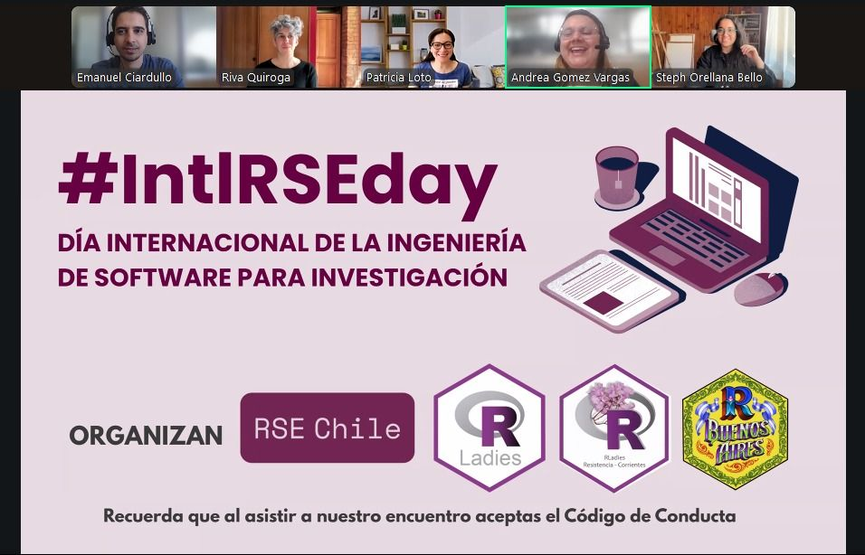
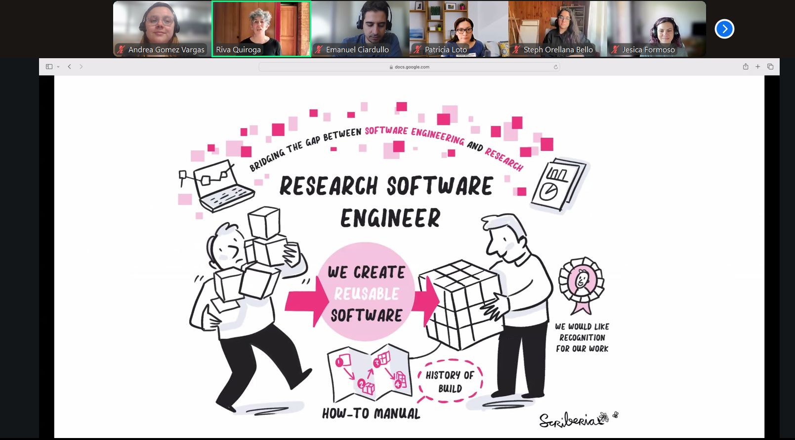

## Charlamos sobre RSE por el #IntlRSEday

#### Octubre 9 — Evento multi-comunidades Latinoamérica

{width="70%"}

Desde 2021, el segundo jueves de octubre se celebra el International Research Software Engineering Day (RSE Day), una iniciativa global destinada a visibilizar a quienes desarrollan, mantienen y sostienen el software que hace posible gran parte de la investigación científica moderna.

En este marco participé como moderadora en un encuentro colaborativo entre comunidades de América Latina:

-   R-Ladies Chile

-   R-Ladies Resistencia-Corrientes

-   R en Buenos Aires

-   RSE Chile

:::::: columns
::: {.column width="50%"}
Durante la sesión conversamos sobre:

-   El origen del movimiento RSE y la necesidad de reconocer el trabajo técnico en la investigación

-   Principales aprendizajes de la conferencia internacional RSECon

-   Cómo se utiliza el lenguaje R en contextos de ingeniería de software para investigación

-   El vínculo entre comunidades abiertas, reproducibilidad y ciencia pública
:::

::: {.column width="10%"}
:::

::: {.column width="40%"}
 

:::
::::::

Además de moderar la conversación, aporté mi experiencia en la [RSECon25](https://soyandrea.github.io/comunidad/2025-RSECon25/) y comunidades open-source, destacando el rol del software reproducible en la estadística pública y en la democratización del acceso a la información.

Este evento reunió participantes de distintos países y perfiles (investigadores, desarrolladores y estudiantes), reforzando el valor de las comunidades técnicas para la construcción colectiva de conocimiento en Latinoamérica.

### 📺 El encuentro quedó disponible en YouTube.

<iframe width="560" height="315" src="https://www.youtube.com/embed/EYbg-Z0pgUs?si=lyGeKYerztrFbFkg" title="YouTube video player" frameborder="0" allow="accelerometer; autoplay; clipboard-write; encrypted-media; gyroscope; picture-in-picture; web-share" referrerpolicy="strict-origin-when-cross-origin" allowfullscreen>

</iframe>
