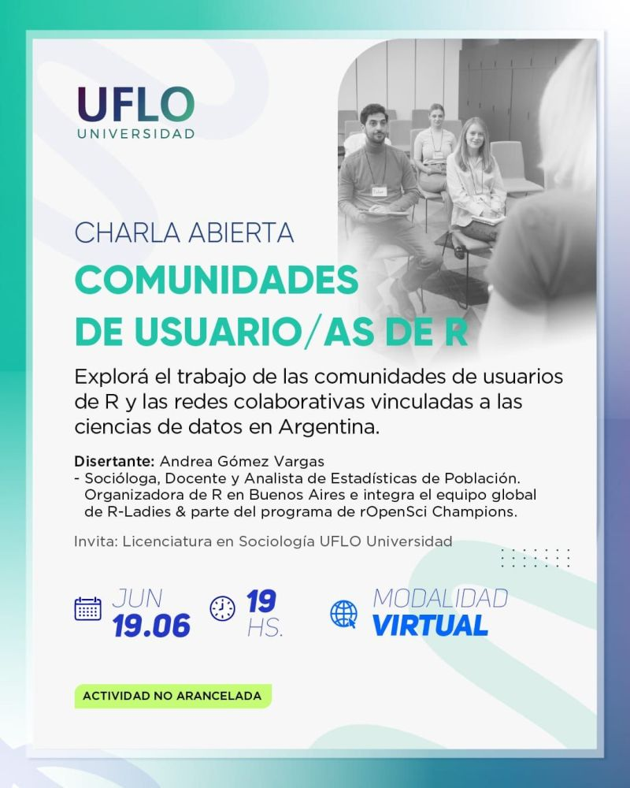

:::: {.columns}

::: {.column width="60%"}

Organizan: materias Análisis de Datos I & Minería de Texto para la investigación Social de la licenciatura de sociología

Moderadoras:

- Ariana Bardauil

- Betsy Cohen

:::

::: {.column width="40%"}

{width=70%}

:::

::::

## Sobre la charla

La propuesta de la charla estaba dirigida principalmente a estudiantes, pero estuvo abierta a cualquier persona interesada en conocer más sobre cómo funcionan las comunidades de usuarios y qué posibilidades pueden ofrecer.

En la charla, conté:

- Por qué las comunidades de usuarios son espacios clave para aprender, crecer y encontrar apoyo.

- Ejemplos de comunidades locales como R en Buenos Aires y R-Ladies Buenos Aires, regionales como LatinR y globales como R-Ladies, rOpenSci, entre otras donde se puede participar, aprender y también enseñar.

- Cómo me acerqué al mundo de R y a sus comunidades, empezando sin tener mucha experiencia.

- La experiencia de desarrollar el paquete `arcenso` y ejemplo práctico de un paquete de datos que nació a partir de un problema real, y de mi trabajo diario como analista de estadísticas de población.

## Presentación

  <iframe loading="lazy" style="position: absolute; width: 100%; height: 100%; top: 0; left: 0; border: none; padding: 0;margin: 0;"
    src="https://www.canva.com/design/DAGqwvsL5AM/3JlvP8qor8Z1tbyhi2qmeA/view?embed" allowfullscreen="allowfullscreen" allow="fullscreen">
  </iframe>

<a href="https:&#x2F;&#x2F;www.canva.com&#x2F;design&#x2F;DAGqwvsL5AM&#x2F;3JlvP8qor8Z1tbyhi2qmeA&#x2F;view?utm_content=DAGqwvsL5AM&amp;utm_campaign=designshare&amp;utm_medium=embeds&amp;utm_source=link" target="_blank" rel="noopener">comunidades R</a> de Andrea Gomez Vargas

>Me encantó compartir este espacio y ver el interés de quienes participaron, llegamos a ser casi 30 personas. Creo que animarse a acercarse a una comunidad (aunque no sepamos mucho al principio) puede abrirnos muchas puertas y ayudarnos a crecer, tanto en lo profesional como en lo personal.

