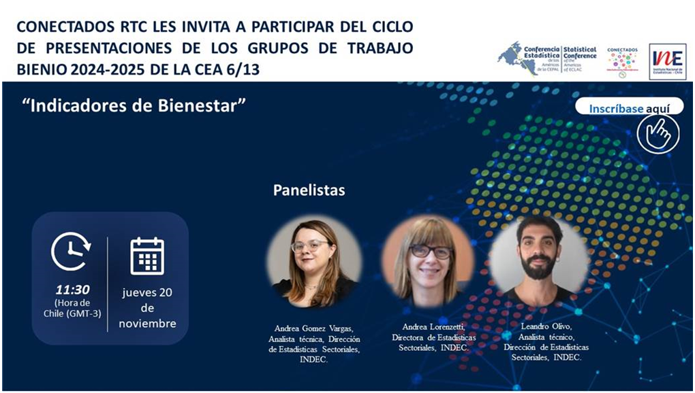

## Guía para la elaboración de sistemas integrados de indicadores de bienestar en América Latina y el Caribe

Durante el bienio 2024-2025, desde la Dirección de Estadísticas Sectoriales del INDEC participamos en la coordinación del Grupo de Trabajo sobre Indicadores de Bienestar de la Conferencia Estadística de las Américas (CEPAL).

El objetivo fue abordar un problema muy concreto del trabajo estadístico: cómo medir el bienestar de manera integral y comparable entre países, cuando la información suele estar dispersa entre múltiples fuentes, con distintos enfoques y niveles de desagregación.

Como resultado elaboramos la Guía para la construcción de sistemas integrados de indicadores de bienestar en América Latina y el Caribe, un marco orientador pensado para ayudar a las oficinas estadísticas a organizar la información, mejorar la comparabilidad y avanzar hacia mediciones multidimensionales de las condiciones de vida.

La guía fue presentada en el ciclo de seminarios organizado por la División de Estadísticas de la CEPAL junto con el INE de Chile, donde se difundieron los resultados de los grupos de trabajo del período.

### Presentación de resultaddos en Youtube

<iframe width="560" height="315" src="https://www.youtube.com/embed/prxrTDKBa0A?si=luTz_vYyKlD72dZ7" title="YouTube video player" frameborder="0" allow="accelerometer; autoplay; clipboard-write; encrypted-media; gyroscope; picture-in-picture; web-share" referrerpolicy="strict-origin-when-cross-origin" allowfullscreen>

</iframe>

### Links útiles

-   [Grupo de Trabajo 2024 - 2025](https://rtc-cea.cepal.org/es/grupo-trabajo/guia-para-la-elaboracion-de-un-sistema-integrado-de-indicadores-de-bienestar/2024)

-   [Publicación CEPAL](https://www.cepal.org/es/publicaciones/83980-guia-la-elaboracion-un-sistema-integrado-indicadores-bienestar)

-   [Red de Transmisión del Conocimiento](https://rtc-cea.cepal.org/es/evento/presentacion-de-resultados-grupos-de-trabajo-cea-2024-2025-indicadores-de-bienestar)
