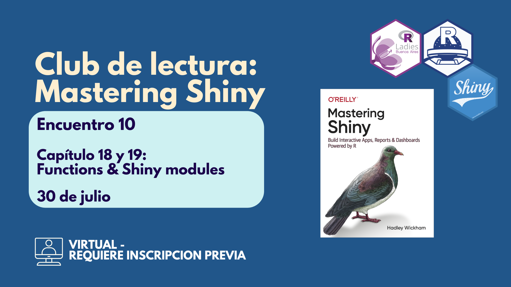

Durante 10 encuentros fuimos leyendo algunos capítulos del libro Mastering Shiny de Hadley Wickham,organizado por [R-Ladies Buenos Aires](https://github.com/RLadies-BA) & [R en Buenos Aires](https://github.com/renbaires)

## Presentación capítulos 18 y 19: funciones y módulos en Shiny

Durante la sesión hicimos el código en vivo para ver cómo reacciona Shiny con estas funciones y entender lo que siginificaban estos conceptos al momento de ponerlos en práctica en un tablero de datos.

<iframe src="https://docs.google.com/presentation/d/e/2PACX-1vTtxoWaxl_1X-02c601c0Zd46KBn5VDipo59hRkf84TgTKRmqJhXJqYVhhwcGW5xr2TOVYcojV334w1/pubembed?start=false&loop=false&delayms=3000" frameborder="0" width="480" height="299" allowfullscreen="true" mozallowfullscreen="true" webkitallowfullscreen="true"></iframe>

## Lo que pasó en vivo

El formato interactivo —ejemplos + pruebas en vivo— resultó muy bien recibido. Las personas participantes comentaron, tomaron nota de los ejemplos y se mostraron muy contentas de haber participado en todo el recorrido del club.

<blockquote class="twitter-tweet">
Llegamos al final del club de lectura de Mastering-Shiny organizado en conjunto con <a href="https://twitter.com/RLadiesBA?ref_src=twsrc%5Etfw">@RLadiesBA</a> 💜. Gracias a todes quienes fueron parte 💫<a href="https://twitter.com/hashtag/rstatsES?src=hash&amp;ref_src=twsrc%5Etfw">#rstatsES</a> <a href="https://t.co/ISeJhrPWOk">pic.twitter.com/ISeJhrPWOk</a>
&mdash; R en Buenos Aires (@renbaires) <a href="https://twitter.com/renbaires/status/1950719770481009092?ref_src=twsrc%5Etfw">July 31, 2025</a></blockquote> 

> Este club fue una gran oportunidad para aprender en comunidad, practicar Shiny y compartir experiencias. ¡Nos vemos en la próxima iniciativa!

## Recursos compartidos

- [Libro Mastering Shiny - Hadley Wickham](https://mastering-shiny.org/)

- [Repositorio de todos los encuentros](https://github.com/renbaires/mastering-shiny/tree/main)

- [Ejemplo de código sobre módulos y funciones](https://github.com/SoyAndrea/shiny-modules)

