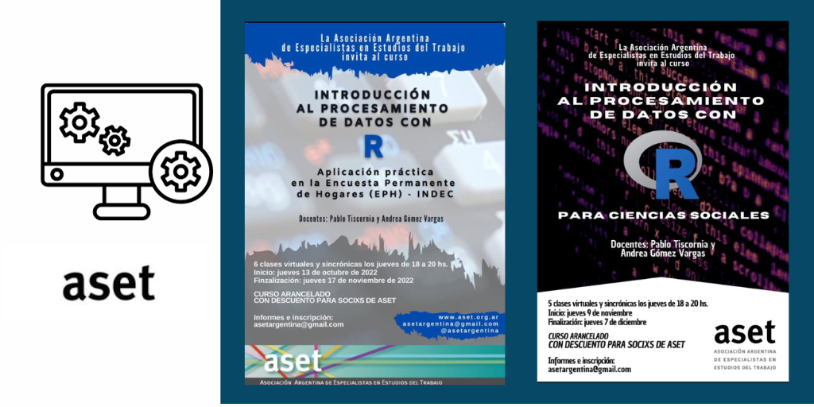

### Edición 2022 & 2023

#### Asociación Argentina de Especialistas en Estudios del Trabajo (ASET)

Junto a [Pablo Tiscornia](https://r-intro-aset.netlify.app/about_pablotiscornia), desarrollamo el taller que tiene como principal objetivo introducir a los y las participantes en el mundo de R y la programación para producir información estadística. La idea es centrarse en cómo encarar un proyecto que involucre meter manos en los datos, desde cómo nombrar mis carpetas o archivos, importarlos para acceder a la información, limpiar los datos y procesarlos hasta como visualizar, analizar y comunicar los hallazgos.

-   [Repositorio del curso](https://github.com/pablotis/intro_r_aset)
