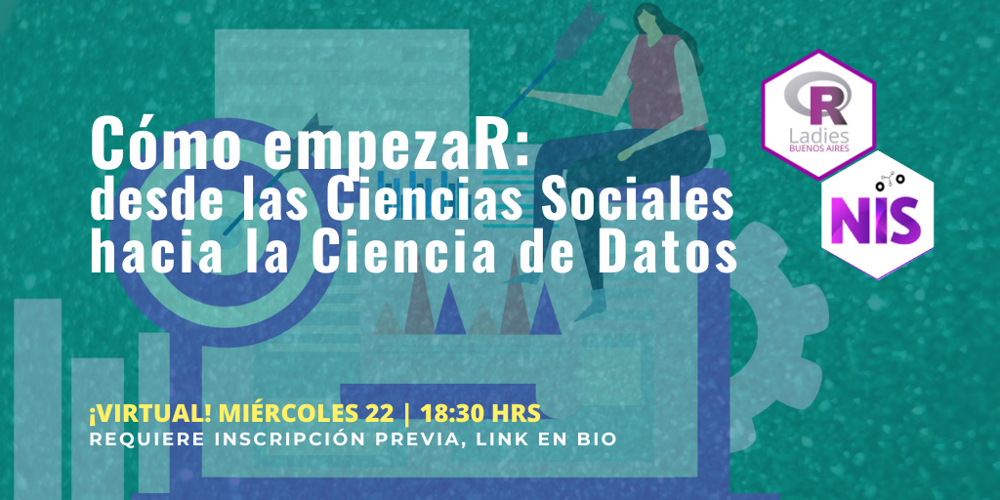

## Cómo empezaR: desde las Ciencias Sociales hacia las Ciencias de Datos

¡Si venís de las Ciencias Sociales y no sabés como empezar en el mundo de la ciencia de datos este meetup es para vos! Desde el Núcleo de Innovación Social (NIS) y RLadies Buenos Aires les traemos esta charla con 4 expositorxs egresadxs de carreras vinculadas a las Ciencias Sociales que trabajan en ciencia de datos.



Cada une contará su experiencia de primera mano sobre cómo arrancaron en este tipo de roles, qué trabas tuvieron, qué dificultades enfrentaron, y qué herramientas consideran que les sumaron y que pueden servirle a unx egresadx que quiera inciarse en mundo de la ciencia de datos.

### Exponen:

-   Andrea Gómez Vargas (@me_andre) - Socióloga
-   Pedro Orden (@pedroorden) - Sociólogo, investigador y científico de datos.
-   Ramiro Fernández (@ramaol) - Sociólogo y científico de datos
-   María Cristina Nanton (@bynans1) - Comunicadora social y analista de datos

### Coordina:

Betsy Cohen (@betsy_ar) - Socióloga

<blockquote class="twitter-tweet">

<p lang="es" dir="ltr">

Gracias a todes les que asistieron a Cómo empezaR de <a href="https://twitter.com/hashtag/rladies?src=hash&amp;ref_src=twsrc%5Etfw">#rladies</a> y el NIS! Son todes parte de esta comunidad <a href="https://twitter.com/hashtag/RStats?src=hash&amp;ref_src=twsrc%5Etfw">#RStats</a> <br><br>Acá toda la alegría del team organizador :D<a href="https://twitter.com/bynans1?ref_src=twsrc%5Etfw">@bynans1</a> <a href="https://twitter.com/JesiFormoso?ref_src=twsrc%5Etfw">@JesiFormoso</a> <a href="https://twitter.com/MonicaLA2000?ref_src=twsrc%5Etfw">@MonicaLA2000</a> <a href="https://twitter.com/pmnatural?ref_src=twsrc%5Etfw">@pmnatural</a> <a href="https://twitter.com/VA_GarciaAlonso?ref_src=twsrc%5Etfw">@VA_GarciaAlonso</a> <a href="https://twitter.com/me_andre?ref_src=twsrc%5Etfw">@me_andre</a> <a href="https://twitter.com/pedroorden?ref_src=twsrc%5Etfw">@pedroorden</a> <a href="https://twitter.com/ramaol?ref_src=twsrc%5Etfw">@ramaol</a> <a href="https://twitter.com/betsy_ar?ref_src=twsrc%5Etfw">@betsy_ar</a> <a href="https://t.co/OFsqI8Ii5d">pic.twitter.com/OFsqI8Ii5d</a>

</p>

— R-Ladies BuenosAires (@RLadiesBA) <a href="https://twitter.com/RLadiesBA/status/1440821762204127234?ref_src=twsrc%5Etfw">September 22, 2021</a>

</blockquote>

```{=html}
<script async src="https://platform.twitter.com/widgets.js" charset="utf-8"></script>
```

### Revive la charla en el canal de Rladies Buenos Aires

<iframe width="560" height="315" src="https://www.youtube.com/embed/isoSCXA2gqo" title="YouTube video player" frameborder="0" allow="accelerometer; autoplay; clipboard-write; encrypted-media; gyroscope; picture-in-picture" allowfullscreen>

</iframe>

<blockquote class="twitter-tweet">

<p lang="es" dir="ltr">

Ahora <a href="https://twitter.com/me_andre?ref_src=twsrc%5Etfw">@me_andre</a> contando que “no siempre se llega directamente a la carrera de datos..." y cuál fue su camino desde la sociología a trabajar en el INDEC! <a href="https://t.co/wNcO92mou3">pic.twitter.com/wNcO92mou3</a>

</p>

— R-Ladies BuenosAires (@RLadiesBA) <a href="https://twitter.com/RLadiesBA/status/1440795986222215170?ref_src=twsrc%5Etfw">September 22, 2021</a>

</blockquote>

```{=html}
<script async src="https://platform.twitter.com/widgets.js" charset="utf-8"></script>
```
