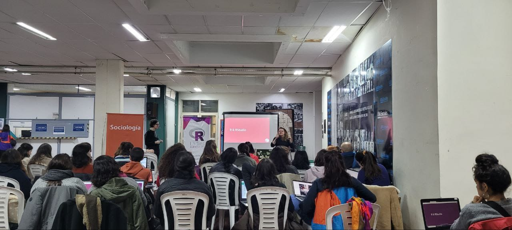

## Ciclo de formaciòn complementaria en UBA sociales


<br> En colaboración con [**Betsy Cohen**](https://github.com/BetsyCohen) desarrollamos y organizadmos el taller desde [R-Ladies Buenos Aires](https://rladiesba.netlify.app/) & el [Núcleo de Innovaciòn Social](https://www.nucleodeinnovacion.com/) para del ciclo de formación complementaria de la carrera de Sociologìa en la Facultad de Ciencias Sociales de la UBA.



En esta ocasión vamos a presentar la potencia de la encuesta y la librería de {tidyverse} para mostrarles cómo podemos obtener bases de datos directamente con el paquete {eph} y vamos a procesarla, traducirla y presentarla en indicadores para el análisis de ciencias sociales.

### Queda a disposición todo el material:

-   [Descarga la Práctica guiada en Rmd](https://drive.google.com/drive/folders/1lWlTc6u-uhUWE5VcuCQRysoSNDmV5HGi?usp=sharing)
-   Repositorio [**GitHub en Taller eph en R**](https://github.com/SoyAndrea/tallerEPH)
-   Web con toda la información del taller: [**eph-ubasociales.netlify.app**](https://eph-ubasociales.netlify.app/)

### Slides generadas con {quarto}.

```{r echo=FALSE}
knitr::include_url("https://eph-ubasociales.netlify.app/slides#/title-slide")
```

### Redes sociales

#### Sociología UBA

<blockquote class="twitter-tweet">

<p lang="es" dir="ltr">

💻\| Meetup sobre EPH en <a href="https://twitter.com/hashtag/SociologiaUBA?src=hash&amp;ref_src=twsrc%5Etfw">#SociologiaUBA</a> <br><br>Llevamos adelante un taller junto al colectivo de mujeres programadoras <a href="https://twitter.com/RLadiesBA?ref_src=twsrc%5Etfw">@RLadiesBA</a> para conocer cómo que es y cómo procesar los datos de la EPH con lenguajes de programación de código abierto (R y Python). <a href="https://t.co/cvo6Y64hf5">pic.twitter.com/cvo6Y64hf5</a>

</p>

— sociologia.uba (@sociologia_uba) <a href="https://twitter.com/sociologia_uba/status/1699954034554044803?ref_src=twsrc%5Etfw">September 8, 2023</a>

</blockquote>

```{=html}
<script async src="https://platform.twitter.com/widgets.js" charset="utf-8"></script>
```

#### Rladies Buenos Aires

<blockquote class="twitter-tweet">

<p lang="es" dir="ltr">

Que lindo volver a los eventos presenciales! <a href="https://twitter.com/me_andre?ref_src=twsrc%5Etfw">@me_andre</a> y <a href="https://twitter.com/betsy_ar?ref_src=twsrc%5Etfw">@betsy_ar</a> presentaron una intro al uso de la EPH en R con sala llena🤩<a href="https://twitter.com/hashtag/RLadies?src=hash&amp;ref_src=twsrc%5Etfw">#RLadies</a> <a href="https://t.co/FsEH0kAzEu">pic.twitter.com/FsEH0kAzEu</a>

</p>

— R-Ladies BuenosAires (@RLadiesBA) <a href="https://twitter.com/RLadiesBA/status/1699949471038062913?ref_src=twsrc%5Etfw">September 8, 2023</a>

</blockquote>

```{=html}
<script async src="https://platform.twitter.com/widgets.js" charset="utf-8"></script>
```

#### Consejo de Profesionales en Sociología

<blockquote class="twitter-tweet">

<p lang="es" dir="ltr">

La Comisión de transformación digital invita a participar del Taller de introducción al Análisis de la Encuesta Permanente de Hogares con R organizado por <a href="https://twitter.com/RLadiesBA?ref_src=twsrc%5Etfw">@RLadiesBA</a> en colaboración con <a href="https://twitter.com/sociologia_uba?ref_src=twsrc%5Etfw">@sociologia_uba</a> y el Núcleo de Innovación Social (NIS). <a href="https://t.co/hsywb9xDpP">pic.twitter.com/hsywb9xDpP</a>

</p>

— Consejo de Profesionales en Sociología (@CPSociologia) <a href="https://twitter.com/CPSociologia/status/1694049790185615512?ref_src=twsrc%5Etfw">August 22, 2023</a>

</blockquote>

```{=html}
<script async src="https://platform.twitter.com/widgets.js" charset="utf-8"></script>
```
