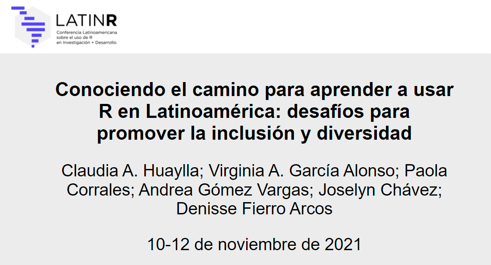
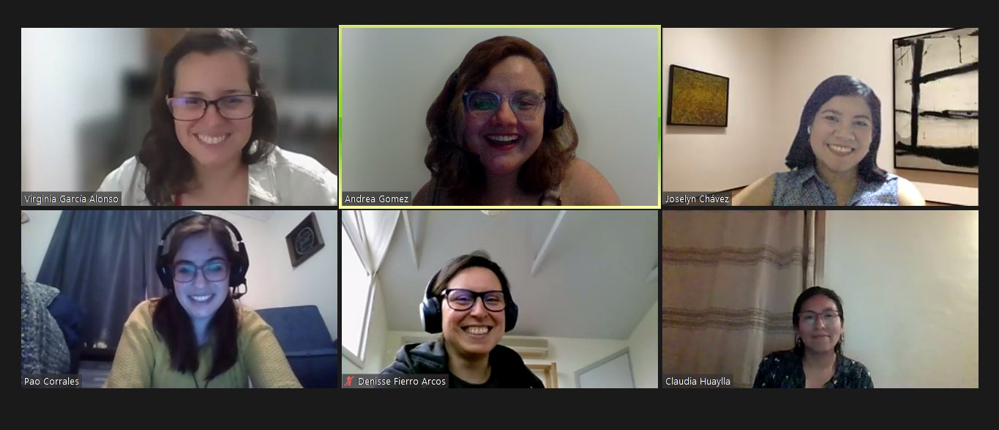

## LatinR 2021 - Sesión iniciativas de la Comunidad de R

### **¿De que se trató esta iniciativa?**

El entorno de R es una poderosa herramienta utilizada mundialmente para diversos fines. A pesar de la gran variedad de usos que se le da a esta herramienta, todas las personas que utilizan R tienen algo en común y es que en algún momento tuvieron que aprender dicho lenguaje. ¿Cuáles fueron los motivos por los cuales lo hicieron? ¿Dónde fue que aprendieron a usar R? ¿Qué desafíos enfrentan aquellas personas que utilizan R?

Estas son algunas de las preguntas incluidas en la primera encuesta Latinoamericana sobre el uso de R realizada en 2020. Creamos dicha encuesta para evaluar qué desafíos enfrentan los usuarios de R en una región donde el idioma, la infraestructura y las diferencias en acceso a recursos, información y capacitación pueden representar una barrera para el aprendizaje y uso de R. Solo conociendo cuáles son esas barreras y dificultades que enfrentaron (o no) al aprender y utilizar R es que se podrían implementar prácticas que mejoren la inclusión de les usuaries.

En esta charla presentaremos el análisis y los resultados de las preguntas antes mencionadas entre otras, e invitaremos a que más personas se sumen a esta iniciativa. La encuesta es abierta y reutilizable dado que buscamos inspirar a otras regiones desatendidas de todo el mundo a identificar sus fortalezas y desafíos y de dicha manera ayudar a aumentar la inclusión y la diversidad de la comunidad internacional de R.

### **Equipo**

[Paola Corrales](https://paocorrales.github.io/) (CIMA, FCEN, UBA), Claudia A. Huaylla (IRNAD-CONICET-UNRN), Virginia A. García Alonso (IBBEA-CONICET-UBA), Joselyn Chávez (IBt-UNAM), Denisse Fierro Arcos (IMAS-UTAS) y Andrea Gómez Vargas (FSOC, UBA).

### Reviví la presentación en Youtube

<iframe width="560" height="315" src="https://www.youtube.com/embed/O31-2LHZDoM" title="YouTube video player" frameborder="0" allow="accelerometer; autoplay; clipboard-write; encrypted-media; gyroscope; picture-in-picture" allowfullscreen>

</iframe>

### Sesión en vivo 10 de noviembre

<iframe width="560" height="315" src="https://www.youtube.com/embed/4TCNocxRtwo?start=4670" title="YouTube video player" frameborder="0" allow="accelerometer; autoplay; clipboard-write; encrypted-media; gyroscope; picture-in-picture" allowfullscreen>

</iframe>

Todas las presentaciones de **LatinR 2021** [aquí](https://github.com/LatinR/presentaciones-LatinR2021)
