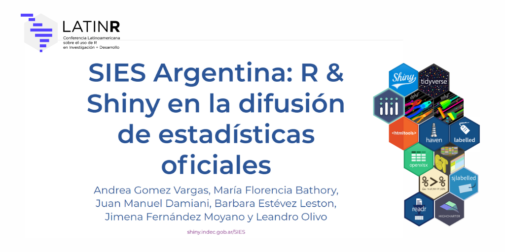
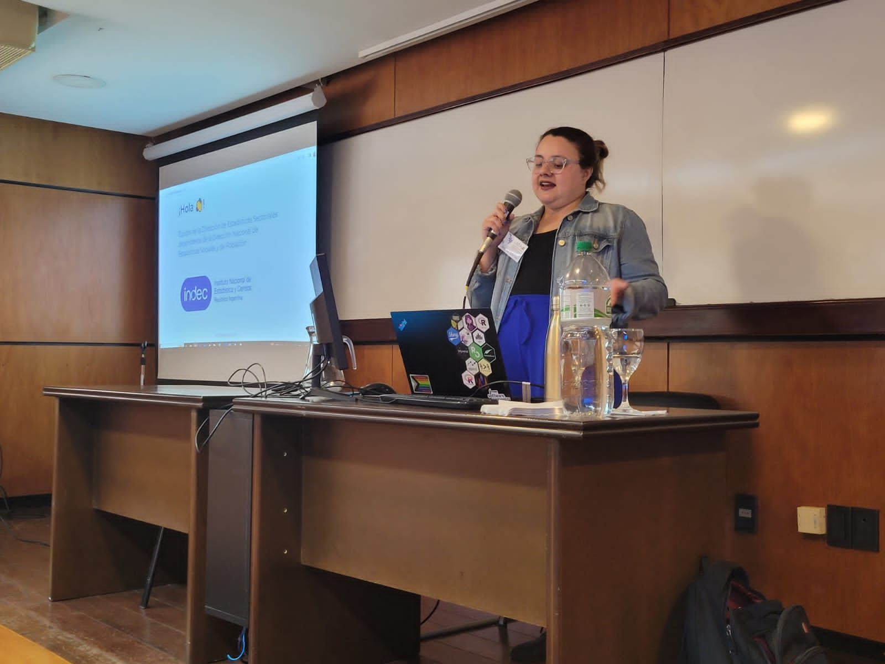
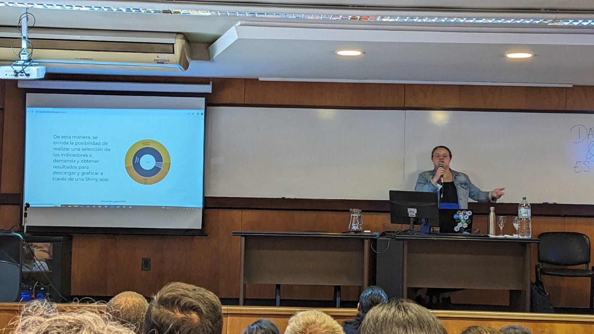

### Conferencia Latinoamericana sobre Uso de R en Investigación + Desarrollo #LatinR

##### 18 al 20 de octubre de 2023 - Montevideo, Uruguay

**Sesión temática: Datos abiertos y estadísticas oficiales (charla 20 minutos)**

📺 [Slides](https://sies-latinr2023.netlify.app/#/title-slide)

:bookmark_tabs: [Resumen](https://github.com/SoyAndrea/SIES_LatinR2023/blob/main/SIES%20Argentina.pdf)

:chart_with_upwards_trend: Shiny app: [shiny.indec.gob.ar/sies](https://shiny.indec.gob.ar/sies/)

### **Resumen**

En esta presentación compartimos el proceso de construcción de la Shiny del Sistema Integrado de Estadísticas Sociales SIES elaborado por el equipo de la Dirección de Estadísticas sectoriales dependiente de la Dirección Nacional de Estadísticas Sociales y de Población de INDEC de Argentina.

En la charla expuse los aprendizajes y dificultades durante este proceso en el equipo, y la importancia de la articulación con otros equipos, organismos públicos y la comunidad de R.

### **Equipo DES**

-   Andrea Gomez Vargas
-   Maria Florencia Bathory
-   Juan Manuel Damiani
-   Barbara Estévez Leston
-   Jimena Fernández Moyano
-   Leandro Olivo

