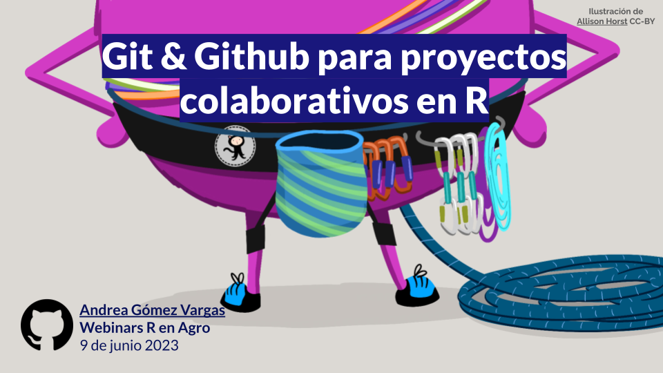

## Taller Por fin vieRnes organizada por el INTA.

Inicia el ciclo de webinars de R en Agronomía del INTA con esta charla virtual sobre proyectos colaborativos en Rstudio con Git & GItHub. Una herramienta indispensable para el trabajo en ciencia de datos, la reproducibilidad y automatización de procesos.

En esta charla se abarcan conceptos y comandos básicos, incluyendo ejemplos en vivo de repositorios remotos y control de cambios.

-   [**Slides**](https://github.com/SoyAndrea/Porfinviernes/blob/main/Git%20y%20Github%20-%209%20de%20junio/9.06.2023%20Github%20para%20proyectos%20colaborativos%20en%20R%20.pdf)

Las ilustraciones son de Allison Horst y Julia Lowndes, tomadas del blog [Openscapes](https://www.openscapes.org/), nota: [GitHub for supporting, contributing, and failing safely](https://www.openscapes.org/blog/2022/05/27/github-illustrated-series/).

