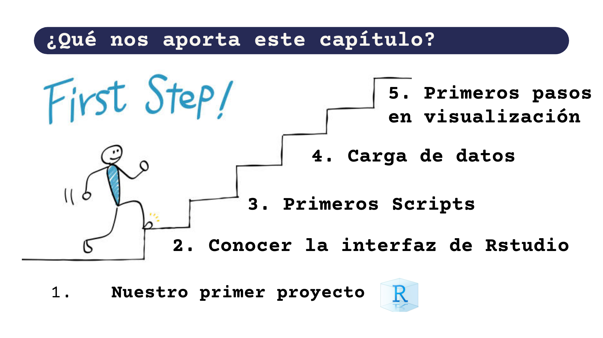

## Capítulo 2: Una presentación a toda marcha de R

Siguiendo con el club de lectura de [**Ciencia de Datos para Gente Sociable de Antonio Vazquez Brust**](https://bitsandbricks.github.io/ciencia_de_datos_gente_sociable/) introducí el segundo capitulo donde ya comenzamos a conocer la interfaz de R studio y armamos nuestro primer proyecto.

Acá conté los primeros 5 pasos que el autor nos invita a conocer y navegar en R:

Quedan muchos capitulos por charlar, sumate a los próximos en [**R en Baires**](https://www.meetup.com/es/renbaires/). Si no puedes asistir, quedan grabados en el canal de youtube.

<iframe width="560" height="315" src="https://www.youtube.com/embed/YZT2hX800yg" title="YouTube video player" frameborder="0" allow="accelerometer; autoplay; clipboard-write; encrypted-media; gyroscope; picture-in-picture" allowfullscreen>

</iframe>
