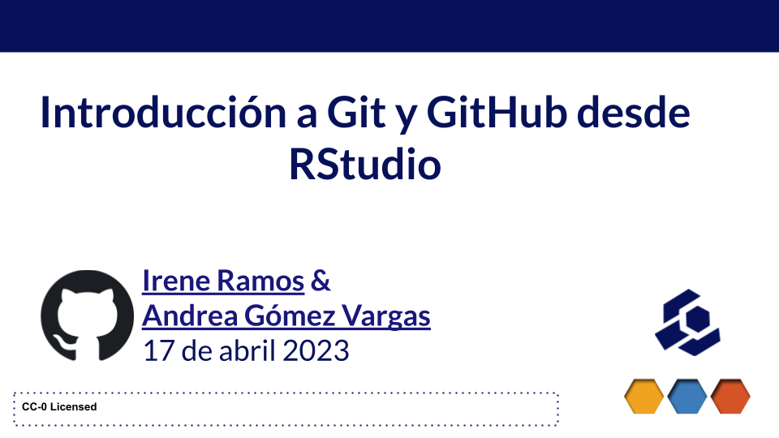

```{r echo=FALSE, out.width="100%", fig.cap="instructoras workshop"}


```

::::: {style="display: grid; grid-template-columns: 1fr 2fr; grid-column-gap: 30px;"}
<div>


</div>

<div>

## **Workshop de The Carpentries en la [csv,conf,v7](https://csvconf.com/)** 🦙

*Novotel Buenos Aires* *17 de Abril, 2023*

</div>
:::::

En el marco de la CSV Conference, una conferencia sobre ciencia de datos aplicada a la ciencia, al periodismo, a las organizaciones gubernamentales y al mundo open source. Realizamos como instructores de the carpentries dos talleres presenciales y gratuitos como parte de las actividades previas e incentivando el uso de R como lenguaje de programación Open Source con las lecciones de **R para Análisis Científicos Reproducibles** & **Introducción a Git y Github desde RStudio**.

```{r echo=FALSE, out.width="100%", fig.cap="instructoras workshop"}
knitr::include_graphics("instructoras.jpg")

```

#### Instructoras:

-   [Irene Ramos](https://github.com/iramosp/)
-   [Andrea Gómez Vargas](https://github.com/SoyAndrea)

#### Ayudantes:

-   [Virginia García Alonso](https://github.com/virginiagarciaalonso)
-   [Natalia Morandeira](https://github.com/nmorandeira)
-   [Pamela Pairo](https://github.com/PamelaPairo)

### Lección aplicada


-   Conoce el sitio web del [**Workshop**](https://virginiagarciaalonso.github.io/2023-04-17-csvconf-r-git/)

-   Repositorio GitHub [Workshop Git y Github desde RStudio en la csv,conf,v7 🦙](https://github.com/SoyAndrea/csvconfv7)

-   Lección The Carpentries aplicada en español: [El Control de Versiones con Git](https://swcarpentry.github.io/git-novice-es/)

Software Carpentry pretende ayudar a las y los investigadores a realizar su trabajo en menos tiempo y con menos esfuerzo enseñándoles técnicas informáticas básicas para la investigación. Este taller práctico cubrirá conceptos y herramientas básicas, incluyendo control de versiones, gestión de datos, y automatización de tareas. Se animará a los participantes a ayudarse y a aplicar lo aprendido a sus propios problemas de investigación.

Más información sobre Software Carpentry: Teaching basic lab skills for research computing en <https://software-carpentry.org/>

### Redes sociales

:::::: {style="display: grid; grid-template-columns: 1fr 1fr; grid-column-gap: 50px;"}
<div>

<blockquote class="twitter-tweet">

<p lang="en" dir="ltr">

Say👋🏾👋🏽to our Instructors in Buenos Aires! The pre-conference workshop with <a href="https://twitter.com/dataverseorg?ref_src=twsrc%5Etfw">@dataverseorg</a> at <a href="https://twitter.com/hashtag/csvconf?src=hash&amp;ref_src=twsrc%5Etfw">#csvconf</a> was a success! <a href="https://twitter.com/hashtag/commallama?src=hash&amp;ref_src=twsrc%5Etfw">#commallama</a> <a href="https://t.co/6AQ5xVQAC1">pic.twitter.com/6AQ5xVQAC1</a>

</p>

— The Carpentries (@thecarpentries) <a href="https://twitter.com/thecarpentries/status/1649050567145299969?ref_src=twsrc%5Etfw">April 20, 2023</a>

</blockquote>

```{=html}
<script async src="https://platform.twitter.com/widgets.js" charset="utf-8"></script>
```

</div>

<div>

<blockquote class="twitter-tweet">

<p lang="es" dir="ltr">

En la previa de <a href="https://twitter.com/CSVConference?ref_src=twsrc%5Etfw">@CSVConference</a> un gran taller de <a href="https://twitter.com/thecarpentries?ref_src=twsrc%5Etfw">@thecarpentries</a> sobre Git desde RStudio, con las genias de <a href="https://twitter.com/me_andre?ref_src=twsrc%5Etfw">@me_andre</a> e Irene Ramos!! Ayudando junto a <a href="https://twitter.com/pamepairo?ref_src=twsrc%5Etfw">@pamepairo</a> 💜💜 <a href="https://twitter.com/hashtag/rstats?src=hash&amp;ref_src=twsrc%5Etfw">#rstats</a> <a href="https://twitter.com/hashtag/rstats_es?src=hash&amp;ref_src=twsrc%5Etfw">#rstats_es</a> <a href="https://t.co/hXTfeGm6Y7">pic.twitter.com/hXTfeGm6Y7</a>

</p>

— Natalia Morandeira (@Nat_Mora_) <a href="https://twitter.com/Nat_Mora_/status/1648054772358959119?ref_src=twsrc%5Etfw">April 17, 2023</a>

</blockquote>

```{=html}
<script async src="https://platform.twitter.com/widgets.js" charset="utf-8"></script>
```

</div>

<div>

<blockquote class="twitter-tweet">

<p lang="en" dir="ltr">

Thank you all for an amazing csv,conf,v7 conference! 🦙🇦🇷❤️<a href="https://twitter.com/hashtag/commallama?src=hash&amp;ref_src=twsrc%5Etfw">#commallama</a> <a href="https://twitter.com/hashtag/csvconf?src=hash&amp;ref_src=twsrc%5Etfw">#csvconf</a> <a href="https://t.co/EPEQZLYUYW">pic.twitter.com/EPEQZLYUYW</a>

</p>

— CSVConf (@CSVConference) <a href="https://twitter.com/CSVConference/status/1650167368012759043?ref_src=twsrc%5Etfw">April 23, 2023</a>

</blockquote>

```{=html}
<script async src="https://platform.twitter.com/widgets.js" charset="utf-8"></script>
```

</div>
::::::
