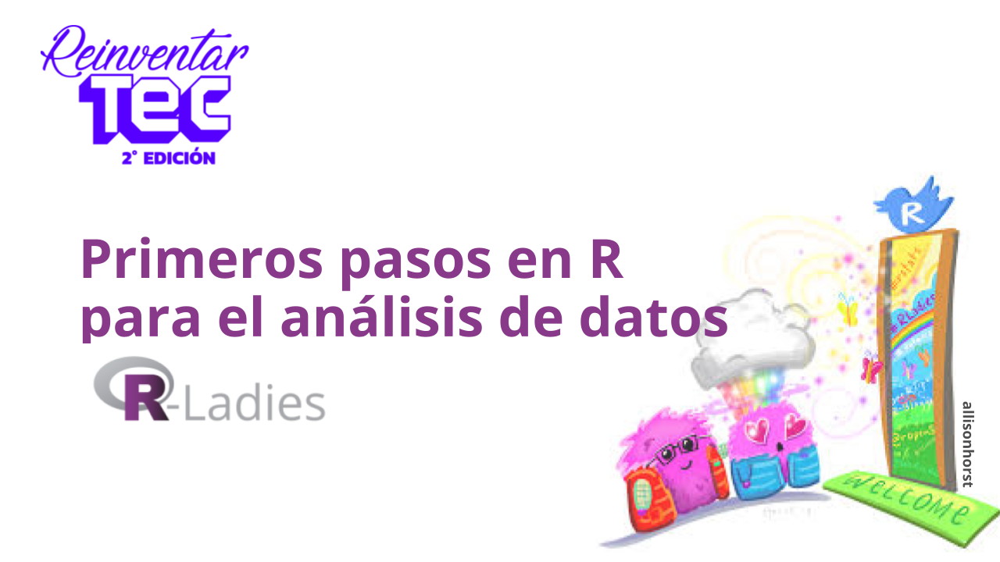
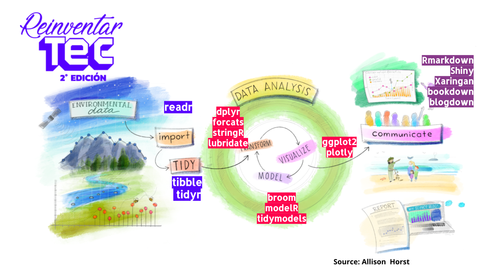
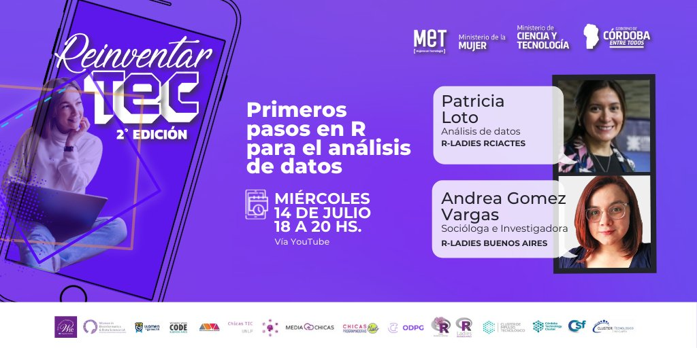

### ReinventarTEC 2021 - taller



Taller organizado por los capítulos de Rladies Buenos Aires, Ushuaia y Resistencia-Corientes, dirigido por Patricia Loto y Andrea Gomez Vargas para la segunda edición de ReinventarTEC. Un ciclo de talleres con el fin de inspirar a mujeres de todas las edades y profesiones a reinventarse y crear un mejor futuro laboral en la era digital.

En esta ocasión quisimos brindar tips y materiales iniciales, gratuitos y accesibles para empezar a hacer análisis de datos con una pequeña introducción para aprender a usar R y tidyverse.



Para que no quedara solo conceptos, realizamos un ejercicio práctico con un dataset sobre LEGO. Te comparto los links con la presentación y ejercicio de práctica.

**Práctica Rstudio desde la nube:** https://rstudio.cloud/project/2704255

**Presentación + Guía de instalación Rstudio:** https://bit.ly/Taller9-ReinventarTEC

**Repositorio en GitHub** https://github.com/PatriLoto/reinventarTEC_2021

-   info: https://mincyt.cba.gov.ar/reinventartec/

<blockquote class="twitter-tweet">

<p lang="pt" dir="ltr">

Terminando! <a href="https://twitter.com/hashtag/ReinventarTEC?src=hash&amp;ref_src=twsrc%5Etfw">#ReinventarTEC</a> <a href="https://twitter.com/hashtag/rladies?src=hash&amp;ref_src=twsrc%5Etfw">#rladies</a><a href="https://twitter.com/RLadies_rciacte?ref_src=twsrc%5Etfw">@RLadies_rciacte</a><br> YouTube: <a href="https://t.co/3Pk31zNKZK">https://t.co/3Pk31zNKZK</a> <a href="https://t.co/csMK1Bj4Rc">pic.twitter.com/csMK1Bj4Rc</a>

</p>

— R-Ladies BuenosAires (@RLadiesBA) <a href="https://twitter.com/RLadiesBA/status/1415446571676745728?ref_src=twsrc%5Etfw">July 14, 2021</a>

</blockquote>

```{=html}
<script async src="https://platform.twitter.com/widgets.js" charset="utf-8"></script>
```

**Míralo en el canal de Youtube del Ministerio**

<iframe width="560" height="315" src="https://www.youtube.com/embed/Q8kKAnB3Xf8" title="YouTube video player" frameborder="0" allow="accelerometer; autoplay; clipboard-write; encrypted-media; gyroscope; picture-in-picture" allowfullscreen>

</iframe>

**Difusión**



**Prensa** [**Finalizó la 2° edición del programa ReinventarTEC**](https://prensa.cba.gov.ar/ciencia-y-tecnologia/ciencia-con-perspectiva-de-genero-finaliza-la-2-edicion-del-programa-reinventartec/)
