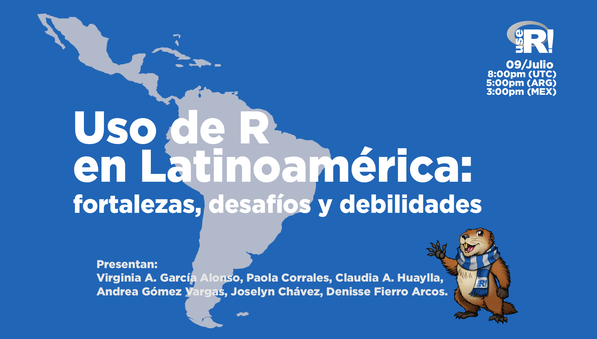
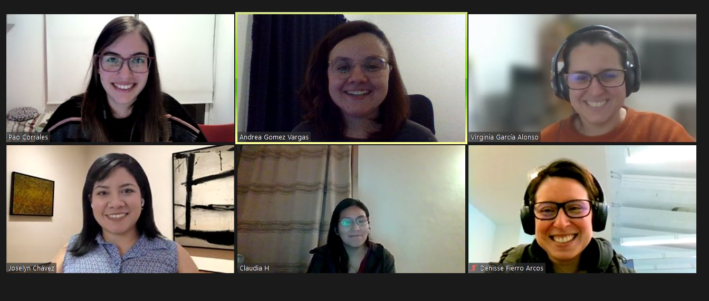
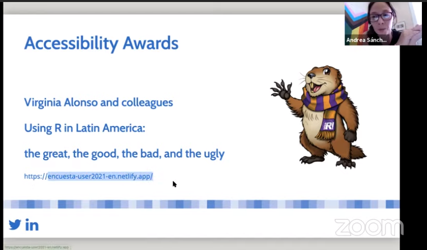

## Uso de R en Latinoamérica: fortalezas, desafíos y debilidades



**Regular talk - Community and Outreach**

### **¿De que se trató esta iniciativa?**

Sabemos que el entorno de R es utilizado globalmente para diversos fines. Sin embargo, ¿qué tan ampliamente es utilizado en países periféricos como los Latinoamericanos donde el inglés no es el idioma oficial y donde la infraestructura y el acceso a diversos recursos no están garantizados entre otros?

En agosto de 2020 un grupo de personas pertenecientes a comunidades de usuarios y usuarias de R en Latinoamérica, nos propusimos generar una encuesta para conocer a las personas que usan R en Latinoamérica, intentando resaltar cuáles son nuestras posibles fortalezas y a qué desafíos nos enfrentamos.

Con base en los objetivos propuestos, diseñamos una encuesta de 31 preguntas las cuales abordaban 5 ejes principales: su interés en R, información demográfica, su nivel académico, su relación con la comunidad de R y el área en que usan R.

Con la finalidad de fomentar la inclusividad, la encuesta fue confeccionada en tres idiomas español, portugués e inglés para que las personas contestaran en el idioma con el que se sintieran más cómodas.

La iniciativa fue difundida en numerosas redes como Twitter, Slack y Telegram de grupos que trabajan con R. Para esta encuesta se invitó a participar a quienes hayan nacido y/o sean residentes en Latinoamérica.

Este pequeño proyecto creció gracias al gran trabajo y colaboración de muchas personas que sumaron preguntas, ayudaron a corregir errores y generaron las distintas traducciones para que esté disponible en español, portugués e inglés y tenga en cuenta la diversidad de realidades en la región. Pero además pasó a ser un proyecto de R-Forwards, el grupo de trabajo de la R Foundation que busca mejorar la inclusión y diversidad en el mundo de R.

Slides en [**español**](https://encuesta-user2021-es.netlify.app/#1) e [**inglés**](https://encuesta-user2021-en.netlify.app/#1)

### **Equipo**:

[Paola Corrales](https://paocorrales.github.io/) (CIMA, FCEN, UBA), Claudia A. Huaylla (IRNAD-CONICET-UNRN), Virginia A. García Alonso (IBBEA-CONICET-UBA), Joselyn Chávez (IBt-UNAM), Denisse Fierro Arcos (IMAS-UTAS), Andrea Gómez Vargas (FSOC, UBA).



### **Accessibility Awards**



La presentación del trabajo fue reconocida por useR! al ser elaborada en dos idiomas y con parámetros de accesibilidad.

<blockquote class="twitter-tweet">

<p lang="en" dir="ltr">

Awards time 🏆<br>Our Accessibility Mentions: Natalia Morandeira, Virginia Alonso and colleagues, and Lluís Revilla. Great job, thank you for making your presentations accessible!

</p>

— useR! 2021 (@_useRconf) <a href="https://twitter.com/_useRconf/status/1413617667500556291?ref_src=twsrc%5Etfw">July 9, 2021</a>

</blockquote>

```{=html}
<script async src="https://platform.twitter.com/widgets.js" charset="utf-8"></script>
```

### Reviví la presentación en Youtube

<iframe width="560" height="315" src="https://www.youtube.com/embed/LyBLJlN6dqo" title="YouTube video player" frameborder="0" allow="accelerometer; autoplay; clipboard-write; encrypted-media; gyroscope; picture-in-picture" allowfullscreen>

</iframe>
